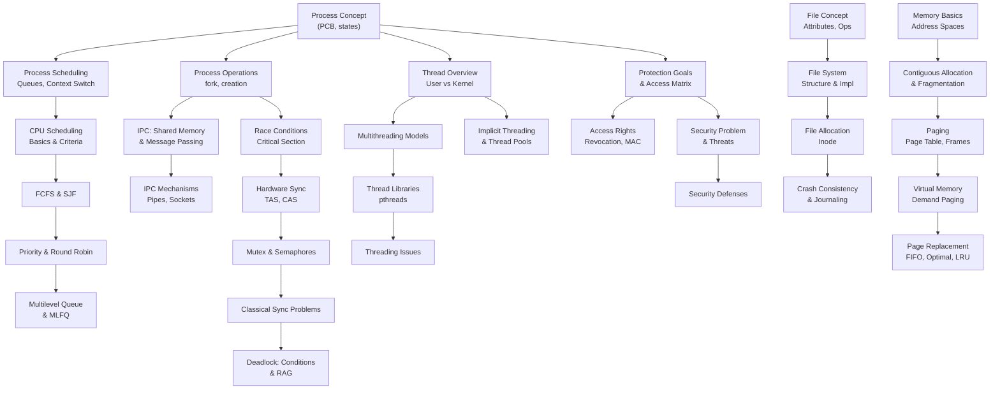

# CSE321 — Topic Map: Operating Systems

> Importance ratings use both the OBE course outline (CO weight distribution) and the
> Questionnaire Preparation Strategy (exam question distribution, practice sheet coverage).
> Topics with dedicated practice sheets and simulation examples = Core.
> Topics with no practice sheet and conceptual-only coverage = Important or Optional.
> Pre-midterm topics are mostly theoretical; post-midterm topics are math-heavy.

## Topic Table

| # | Topic | Module | Importance | Silberschatz Sections | CO | Exam |
|---|-------|--------|------------|----------------------|-----|------|
| 1 | Process concept: PCB, states, state transitions | Process | Core | 3.1.1, 3.1.2 | CO1 | Mid |
| 2 | Process scheduling queues and context switching | Process | Core | 3.1.3, 3.1.4 | CO1 | Mid |
| 3 | Process operations: fork, creation, termination | Process | Core | 3.2 | CO1 | Mid |
| 4 | IPC: shared memory and message passing | Process | Core | 3.3 | CO1 | Mid |
| 5 | IPC mechanisms: pipes and sockets | Process | Important | 3.4 | CO1 | Mid |
| 6 | Thread overview: user vs kernel threads, benefits | Threads | Core | 4.1, 4.2 | CO2 | Mid |
| 7 | Multithreading models: many-to-one, one-to-one, many-to-many | Threads | Core | 4.3 | CO2 | Mid |
| 8 | Thread libraries: pthreads | Threads | Core | 4.4.1 | CO2 | Mid |
| 9 | Implicit threading and thread pools | Threads | Important | 4.5.1 | CO2 | Mid |
| 10 | Threading issues: fork/exec, signal handling, cancellation | Threads | Important | 4.6.1–4.6.3 | CO2 | Mid |
| 11 | CPU scheduling basics: burst cycle, criteria | CPU Scheduling | Core | 5.1.1–5.1.3 | CO1 | Mid |
| 12 | FCFS and SJF scheduling algorithms | CPU Scheduling | Core | 5.2 | CO1 | Mid |
| 13 | Priority scheduling and Round Robin | CPU Scheduling | Core | 5.3 | CO1 | Mid |
| 14 | Multilevel Queue and MLFQ | CPU Scheduling | Core | 5.3 (MLFQ supplement) | CO1 | Mid |
| 15 | Race conditions and critical section problem | Synchronization | Core | 6.1, 6.2 | CO2 | Mid |
| 16 | Hardware synchronization: Test-and-Set, Compare-and-Swap | Synchronization | Core | 6.4.2 | CO2 | Mid |
| 17 | Mutex locks and semaphores | Synchronization | Core | 6.5, 6.6 | CO2 | Mid |
| 18 | Classical synchronization problems | Synchronization | Core | 6.8.1 | CO2 | Mid |
| 19 | Deadlock: necessary conditions and resource allocation graph | Synchronization | Core | 7.1 | CO2 | Mid |
| 20 | File concept: attributes, operations, types | File Systems | Core | 11.1.1 | CO2 | Final |
| 21 | File system structure and implementation | File Systems | Core | 13.1.1, 13.1.2 | CO2 | Final |
| 22 | File allocation: indexed allocation and UNIX inode | File Systems | Core | 14.4.3, OSTEP Ch.40 | CO2 | Final |
| 23 | Crash consistency and journaling | File Systems | Important | OSTEP Ch.42 | CO2 | Final |
| 24 | Memory basics: address spaces, binding, logical vs physical | Memory Mgmt | Core | 9.1.1, 9.1.3 | CO3 | Final |
| 25 | Contiguous allocation and fragmentation | Memory Mgmt | Core | 9.3 | CO3 | Final |
| 26 | Paging: page table, frames, address translation | Memory Mgmt | Core | 9.4.1 | CO3 | Final |
| 27 | Virtual memory and demand paging | Memory Mgmt | Core | 10.1, 10.2.1, 10.2.2 | CO3 | Final |
| 28 | Page replacement algorithms: FIFO, Optimal, LRU | Memory Mgmt | Core | 10.4.2–10.4.4 | CO3 | Final |
| 29 | Protection goals, principles, and access matrix | Protection | Important | 17.1, 17.2, 17.4, 17.5 | CO1 | Final |
| 30 | Access rights: revocation, MAC, capability-based systems | Protection | Important | 17.7, 17.9, 17.10, 17.11 | CO1 | Final |
| 31 | Security problem, violation categories, program threats | Security | Important | 16.1, 16.2 | CO1 | Final |
| 32 | Security defenses: cryptography, firewalls, intrusion detection | Security | Important | 16.6.1–16.6.4, 16.6.6 | CO1 | Final |

**Note on Virtual Machines & Containers** (OBE outline Weeks 13–14): absent from the Summer 2026 course schedule CSV. Likely dropped from this semester's syllabus. Not included in the topic map; revisit if the instructor announces otherwise.

---

## Dependency Graph

---

## Recommended Study Order

### Pre-Midterm (Topics 1–19)

1. Process concept: PCB, states, transitions
2. Process scheduling queues and context switching
3. Process operations: fork, creation, termination
4. IPC: shared memory and message passing
5. IPC mechanisms: pipes and sockets
6. Thread overview: user vs kernel threads
7. Multithreading models
8. Thread libraries: pthreads
9. Implicit threading and thread pools
10. Threading issues: fork/exec, signal handling, cancellation
11. CPU scheduling basics and criteria
12. FCFS and SJF
13. Priority scheduling and Round Robin
14. Multilevel Queue and MLFQ
15. Race conditions and critical section problem
16. Hardware synchronization: TAS and CAS
17. Mutex locks and semaphores
18. Classical synchronization problems
19. Deadlock: conditions and resource allocation graph

### Post-Midterm (Topics 20–32)

20. File concept: attributes, operations, types
21. File system structure and implementation
22. File allocation: indexed allocation and UNIX inode
23. Crash consistency and journaling
24. Memory basics: address spaces and binding
25. Contiguous allocation and fragmentation
26. Paging: page table, frames, address translation
27. Virtual memory and demand paging
28. Page replacement: FIFO, Optimal, LRU
29. Protection goals, principles, and access matrix
30. Access rights: revocation, MAC, capability-based systems
31. Security problem, violation categories, program threats
32. Security defenses: cryptography, firewalls, intrusion detection
