# CSE331 — Lecture 2: DFA Definition

*Starts partway through notebook page 6 (undated, continuing directly from [CSE331_lecture_01_prelims](CSE331_lecture_01_prelims.md)) through page 13.*

## Finite Automaton — Introduction

Composed of **states** and **transitions**.

- **DFA** — Deterministic Finite Automaton
- **NFA** — Non-deterministic Finite Automaton

**Example (informal):** a two-state machine modeling a lock —

```
Locked --button--> Unlocked --button--> Locked (toggle)
```

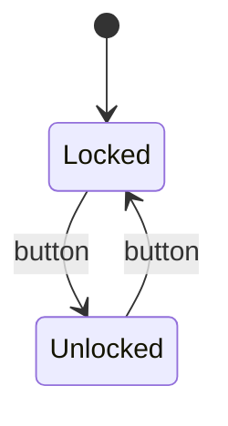

## Finite Automaton — 5 Elements (Formal Definition)

$$(Q, \Sigma, \delta, q_0, F)$$

- $Q$ (capital $Q$) — set of all states
- $\Sigma$ — alphabet (input)
- $\delta$ — transition function/delta
- $q_0$ (small $s$/$q_0$) — starting state
- $F$ — set of all accepting states (capital usually means set)

**Worked example (Locked/Unlocked):**
$$Q = \{Locked, Unlocked\}$$
$$F = \{even\}$$

**Even/odd counting automaton:**
- Two states: `even`, `odd`
- On input `1`: toggles between even and odd
- On input `0`: stays in current state
- Start state: `even`, accepting state: `F = {even}`

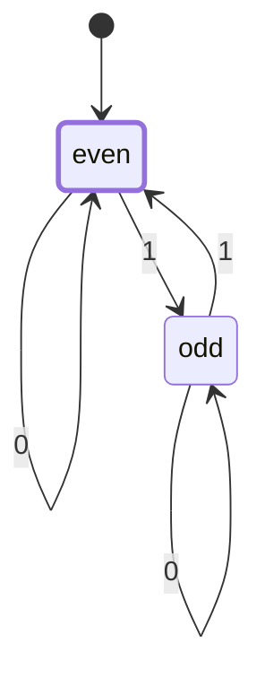

## DFA: Deterministic Finite Automaton

Two defining properties:
1. Needs to show **all** transitions for **all** inputs.
2. From one state and one input, transition happens to **only one** state.

$\Sigma = \{0, 1\}$

**Example — accepts odd number of 1s:**
State diagram with self-loops on both states, alternating on input `1`.

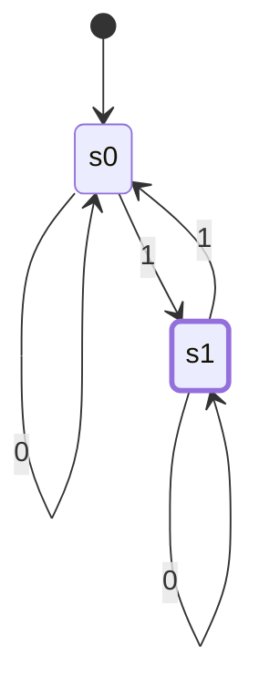
*(s0 = even count of 1s seen so far, s1 = odd — same shape as the even/odd counter above, but here the "odd" state is the one accepting.)*

## Worked DFA Examples

### Starts with 1

States $q_1, q_2, q_3$: $q_1 \xrightarrow{1} q_2$ (accepting, self-loop on 0,1), $q_1 \xrightarrow{0} q_3$ (trap, self-loop on 0,1).

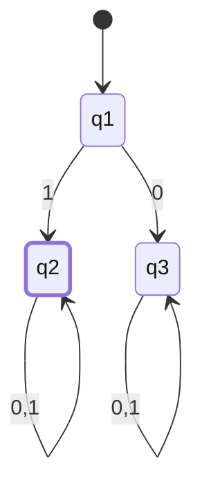

### Starts with 1, ends with 0

The source works this up in two steps:

**Step 1 — building block, "just ends with 0"** (ignoring the starts-with-1 condition): $q_1$ (start) $\xrightarrow{0} q_2$ (accepting), $q_1 \xrightarrow{1} q_3$; then $q_2 \xleftrightarrow{1} q_3$ toggle. Reading of the diagram: $q_1$ = no symbols yet, $q_2$ = last symbol was 0 (accepting), $q_3$ = last symbol was 1.

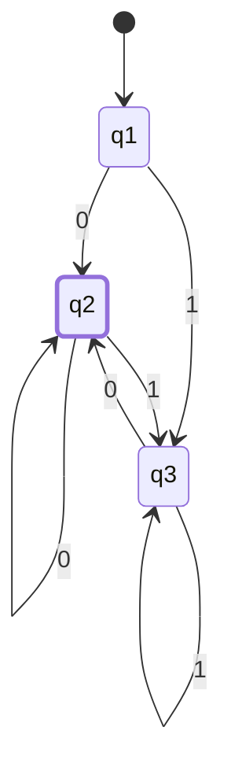
*(Self-loops on q2/q3 filled in from the "last symbol" state semantics above — the source text names the states but doesn't spell out every transition; this is the only DFA consistent with that reading, not a separate guess.)*

**Step 2 — full condition, "starts with 1 AND ends with 0":** a second, separate diagram below it: $q_1 \xrightarrow{1} q_2 \xrightarrow{0} q_4$, and $q_1 \xrightarrow{0} q_3$ (trap, self-loop 0,1, for strings not starting with 1).

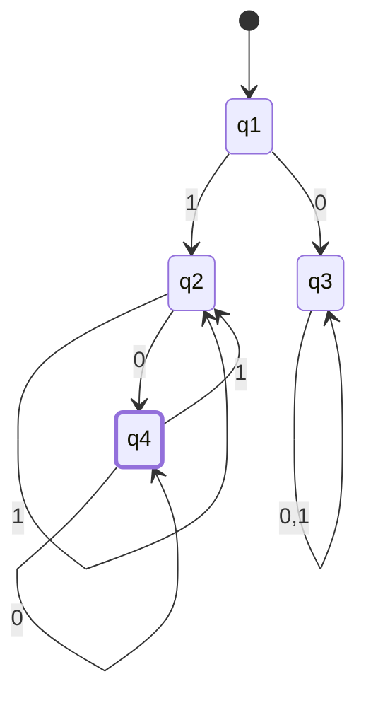

### Starts with 1, ends with consecutive odd 0s

Test cases: `10` ✓ (accepted), `1000` ✓ (accepted), `10100` ✗ (rejected)
States $q_1, q_2, q_3, q_4, q_5$ — chain with self-loop on `1` at $q_2$, alternating 0-transitions between $q_4$ (accepting) and $q_5$, trap state $q_3$ on leading 0.

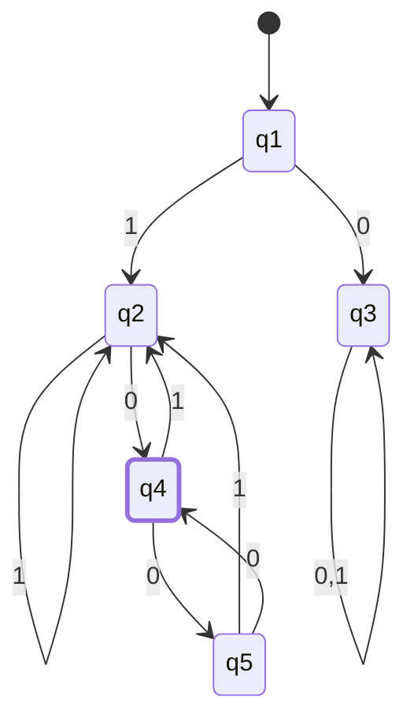

### Starts and ends with same symbol

Uses $\varepsilon$ transitions splitting into two branches (starts-with-0-ends-with-0, starts-with-1-ends-with-1), unioned via $\cup / \Sigma$.

5-tuple notation repeated: $(Q, \Sigma, \delta, q_0, F)$ — small $s$ for starting state noted explicitly.

State diagram: $q_1 \xrightarrow{0} q_2 \xrightarrow{1} q_4$ (self-loop 1), and $q_1 \xrightarrow{1} q_3 \xleftarrow{0} q_5$ (self-loop 0), with $q_3$ self-loop on 1.

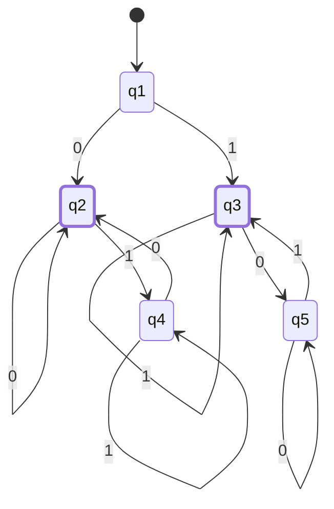
*(q2 = started with 0, last symbol 0 — accepting. q4 = started with 0, last symbol 1. q3 = started with 1, last symbol 1 — accepting. q5 = started with 1, last symbol 0. q1 = start. Confirmed against the regex for the same language in [CSE331_lecture_07_2026-07-06](CSE331_lecture_07_2026-07-06.md): $0\Sigma^*0 \cup 1\Sigma^*1 \cup 1 \cup 0$.)*

### Contains substring 101

$q_1$ (self-loop 0) $\xrightarrow{1} q_2$ (self-loop 1) $\xrightarrow{0} q_3 \xrightarrow{1} q_4$ (accepting, self-loop 0,1); with a back-edge from $q_3$ to $q_1$ on `0`.

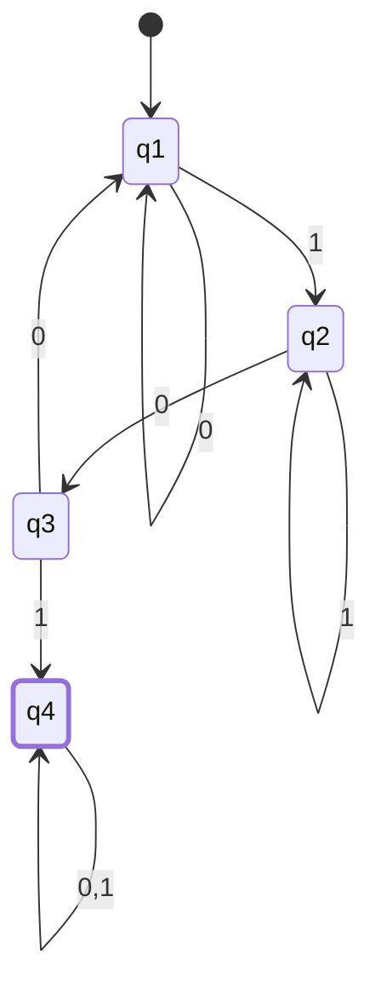

### Length constraints

- **Length exactly 2:** $q_1 \xrightarrow{0,1} q_2 \xrightarrow{0,1} q_3$ (accepting, trap after on 0,1)

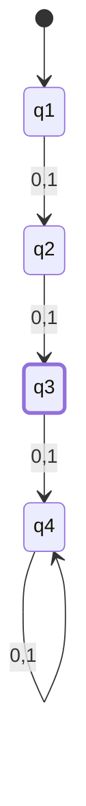
*(q4 = the unnamed "trap beyond" state implied by the text — not explicitly numbered in the source.)*

- **Length at least 2:** chain of 3 states on $\{0,1\}$, third state accepting with self-loop $\{0,1\}$

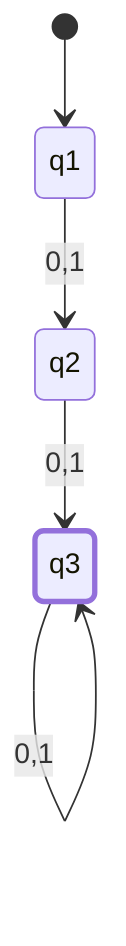

- **Length at most 2:** $q_1$ (accepting) $\to q_2$ (accepting) $\to q_3$ (accepting), all on $\{0,1\}$, with trap beyond

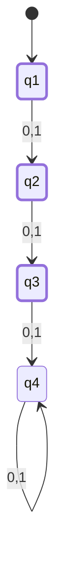
*(q4 = trap, same "unnamed trap beyond" convention as above.)*

## Anki Cards

START
Basic
What are the two defining properties of a DFA (as opposed to an NFA)?
Back: (1) It must show all transitions for all inputs from every state. (2) From any one state and one input symbol, the transition goes to exactly one state.
END

START
Basic
What is the formal 5-tuple definition of a finite automaton?
Back: (Q, Σ, δ, q₀, F) — Q = set of states, Σ = alphabet, δ = transition function, q₀ = start state, F = set of accepting states.
END
