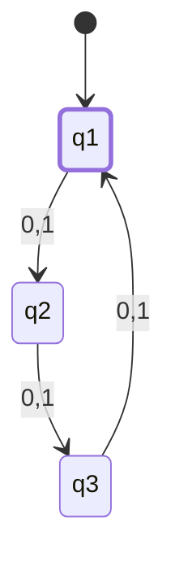
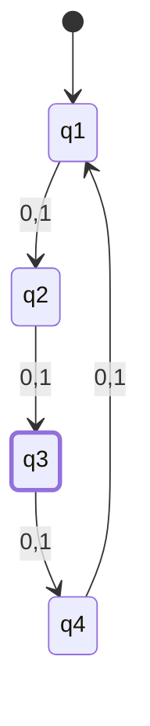
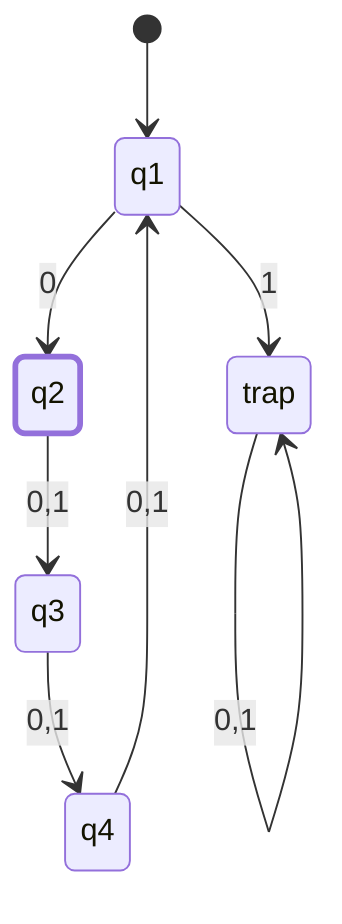
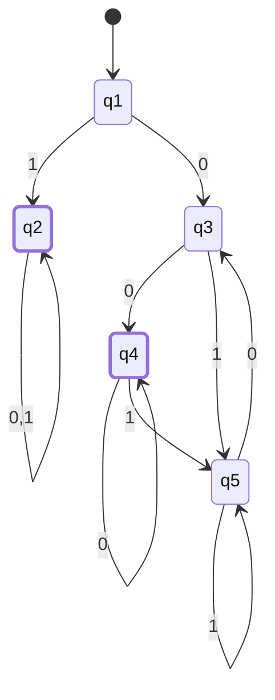
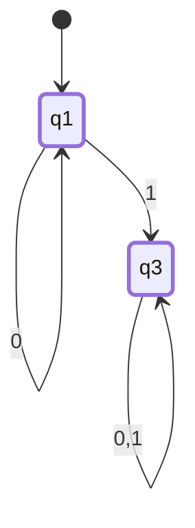

# CSE331 — Lecture 3: Modular-Length DFAs and Regular Operations

$\Sigma = \{0, 1\}$

## Length is a multiple of 3

$q_1 \xrightarrow{0,1} q_2 \xrightarrow{0,1} q_3 \xrightarrow{0,1} q_1$ (cycle back). $q_1$ accepting.

- $|w| \% 3 = 0 \Rightarrow q_1$
- $|w| \% 3 = 1 \Rightarrow q_2$
- $|w| \% 3 = 2 \Rightarrow q_3$

Reference arithmetic noted: $6\%3=0$, $0\%3=0$.

## Length is $4n+2$, $n \ge 0$

Chain $q_1 \to q_2 \to q_3 \to q_4 \to q_1$ (cycle of 4 states on $\{0,1\}$), accepting state $q_3$.

Check: $4(1)-1=3$, $4(1)-2=2$, $4(1)-3=1$ — reference arithmetic for the related family $4n-3, n \ge 1$.

## Length is $4n-3$, $n \ge 1$ — position $4k-3$ must be 0

**Strings whose length is of the form $4n-3$ (i.e. $1, 5, 9, 13, \dots$), where every position $\equiv 1 \pmod 4$ — positions $1, 5, 9, \dots$, including the string's own last position — must be the symbol 0.** Positions $\equiv 2, 3, 0 \pmod 4$ are unconstrained.

Design: track (symbols read so far) mod 4 with a 4-state cycle, same skeleton as the $4n+2$ example above. The one difference: the transition out of the "count $\equiv 0 \pmod 4$" state is constrained — reading a 1 there violates the position-$4k{+}1$ requirement and dead-ends into a trap. Accept only in the state reached right after a *valid* constrained position ($q_2$ below) — that's exactly where a string of length $4n-3$ can legally end.

*($q_1$ = count $\equiv 0 \pmod 4$ symbols read — next symbol lands on a constrained position. $q_2$ = count $\equiv 1 \pmod 4$ — accepting. $q_3$ = count $\equiv 2 \pmod 4$; $q_4$ = count $\equiv 3 \pmod 4$ — both unconstrained. Empty string ends at $q_1$, correctly non-accepting since $n\ge1$ requires length $\ge 1$.)*

Verified: "0" (len 1) → $q_1{-}0{\to}q_2$, accept. "1" (len 1) → $q_1{-}1{\to}$trap, reject (position 1 violated). "00001" (len 5) → $q_1 q_2 q_3 q_4 q_1$, then position 5 reads "1" → trap, reject (position 5 ≡ 1 mod 4 violated). "00000" (len 5) → same path but position 5 reads "0" → $q_2$, accept.

## Regular Operations

Three regular operations:
1. **Union**
2. **Concatenation**
3. **Kleene Star** — $\Sigma^*$: zero or more repeats

### $L_1 \cup L_2$ (worked construction)

Example languages: $L_1$ = "starts with 1", $L_2$ = "ends with 00". State diagram combining both via a shared/branching structure across $q_1$–$q_5$ — a direct 5-state construction, not cross-product. $q_2$ is an absorbing accept state (once the string starts with 1, $L_1$ is already satisfied regardless of the rest). $q_3/q_4/q_5$ track the "ends with 00" component in the branch where the string started with 0: $q_3$ = last symbol 0 (not yet "00"), $q_4$ = ends with 00 (accepting), $q_5$ = last symbol 1 (not accepting).

### $L_1 \cap L_2$

$$L_1 = 0^h, \quad L_2 = 1^m \text{ (m is odd)}$$

Example: $2^2 = 2 \cdot 2$, string family $0^n, n=0 \Rightarrow 0^0 = \varepsilon$.

*(Teaching point confirmed: $L_1$ (all-0 strings) and $L_2$ (all-1 strings of odd length) can only ever share the empty string, and $\varepsilon \notin L_2$ since $m$ must be odd — so $L_1 \cap L_2 = \emptyset$. The example demonstrates that intersecting two regular languages can legitimately produce the empty language.)*

### $L_1 . L_2$ (concatenation)

$L_1 = 0^*$ (all-zero strings, recognized by $q_1$). State diagram: $q_1$ (self-loop 0, accepting) $\xrightarrow{1} q_3$ (self-loop 0,1) — representing $L_1$ concatenated with $L_2$.

*($q_3$ marked accepting — a single state with a blanket self-loop on both symbols can only represent $L_2 = \Sigma^*$ (accept anything from here on), since it has no structure to distinguish any continuation from any other. That makes this $L_1.L_2 = 0^*.\Sigma^* = \Sigma^*$: a simple worked example of concatenation mechanics, not a specific interesting language. The source didn't mark $q_3$ accepting or name $L_2$, but a non-accepting $q_3$ wouldn't represent a concatenation with any $L_2$ at all — just $L_1$ alone with a dead trap attached.)*

> [!warning] Not a template for the general construction method
> This diagram gives the correct final language ($\Sigma^*$), but it does **not** demonstrate the general concatenation procedure TNF wants for a proof question (ε-transition from $M_1$'s accepting state into $M_2$'s start, with $M_1$'s accepting states demoted — see [[CSE331_midterm_regular_languages|midterm revision guide]] Analytical Q3 / Closure section). Two deviations here:
> 1. $q_1$ (an $M_1$-accepting state) stays **accepting** in the combined machine instead of being demoted.
> 2. The move from $q_1$ to $q_3$ consumes a real symbol ("1") instead of an ε-transition.
>
> It still computes the right language only because $\varepsilon \in L_2 = \Sigma^*$: in the proper NFA construction, the ε-edge from a demoted $M_1$-accept state would land in $M_2$'s epsilon-closure, which is already accepting — so the "$M_1$ alone" case survives through the ε-chain rather than through $q_1$ itself staying marked accepting. This diagram just collapses that into a DFA shortcut. Do not reuse this pattern (keep-$M_1$-accepting, real-symbol-transition) as the generalized proof answer — use the demote-then-ε procedure instead.

## Anki Cards

START
Basic
What are the three regular operations on languages?
Back: Union, Concatenation, and Kleene Star (zero or more repetitions).
END

START
Basic
For a DFA recognizing "length is a multiple of 3" over Σ={0,1}, how many states are needed and why?
Back: 3 states — one for each residue class mod 3 (remainder 0, 1, or 2 when dividing the string length by 3), with the remainder-0 state as the only accepting state.
END
