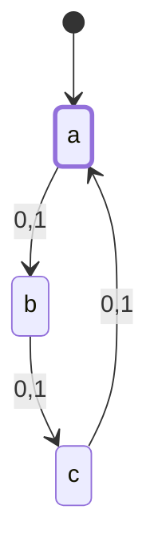
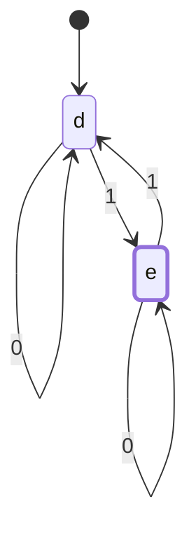
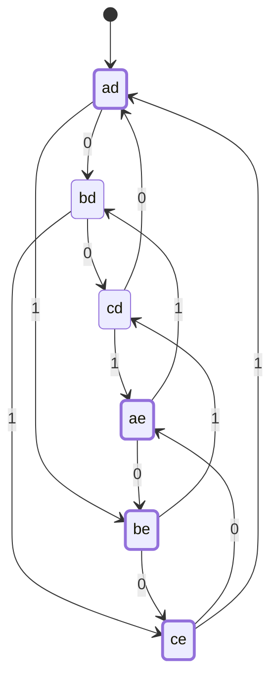
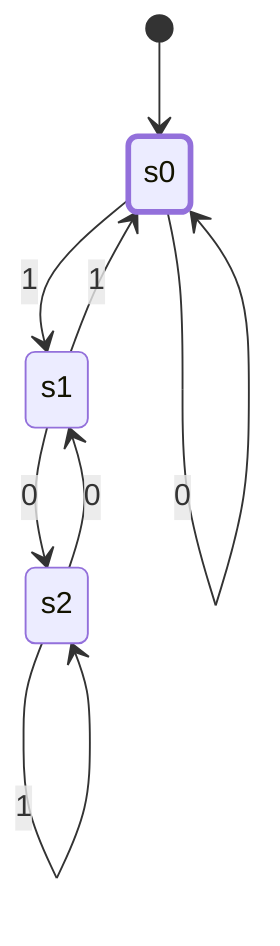

# CSE331 — Lecture 4: Cross Product Rule

## Cross Product Rule

Used to construct a DFA for $L_1 \cup L_2$ (or $\cap$) by combining two component DFAs.

**$L_1$:** length is a multiple of 3 — 3-state cycle $a \to b \to c \to a$ on $\{0,1\}$, $a$ accepting.

**$L_2$:** contains an odd number of 1s (implied) — 2-state machine on $d, e$.

*(d/e wired as the standard odd-1s toggle — same construction as [CSE331_lecture_02_2026-06-15](CSE331_lecture_02_2026-06-15.md)'s odd-number-of-1s example, applied here since $L_2$'s property is named but the source only says "2-state machine.")*

$$Q_1 = \{a, b, c\}, \quad Q_2 = \{d, e\}$$
$$Q_1 \times Q_2 = \{ad, bd, cd, ae, be, ce\}$$

Combined state diagram for $L_1 \cup L_2$ built over the 6 cross-product states ($ad, bd, cd, ae, be, ce$), with transitions on 0 and 1 carried over from each component machine.

*(Derived mechanically from the two component DFAs above, not transcribed from the scan — the source only describes this diagram in prose. Accepting states are every pair containing $a$ (mod-3 remainder 0) or $e$ (odd 1s), matching the union.)*

**How each cross-product transition is derived:** each combined state is a pair $XY$ where $X \in Q_1$ and $Y \in Q_2$. On input symbol $s$, the combined machine moves componentwise — independently step $X$ forward in $M_1$'s diagram and $Y$ forward in $M_2$'s diagram, then the new combined state is just the pair of wherever each landed.

Worked example: **$ad \xrightarrow{0} bd$** — on input 0, look up each component separately: in $M_1$ ($a,b,c$ cycle), $a \xrightarrow{0} b$; in $M_2$ ($d,e$ toggle), $d \xrightarrow{0} d$ (self-loop, since $M_2$ only toggles on 1). Combine the two results: $b$ and $d$ → new state $bd$. That's the entire rule — no other lookup is needed, and the two components are read completely independently of each other.

Second example, to show a case where both halves move: **$bd \xrightarrow{1} ce$** — on input 1: in $M_1$, $b \xrightarrow{1} c$; in $M_2$, $d \xrightarrow{1} e$. Combine: $c$ and $e$ → $ce$.

This is why the cross-product DFA never needs more states than $|Q_1| \times |Q_2|$ — every reachable combined state is just some pair of an $M_1$-state and an $M_2$-state, and each component's own transition table is reused unchanged, never redefined.

## Divisibility by 3 (binary string interpretation)

**Rule:** when a string is considered as a binary number, the string (as a whole) is divisible by 3.

3-state DFA over $\{0,1\}$, states labeled `0`, `1`, `2` (representing remainder mod 3), start/accept state `0`:
- State `0` (remainder 0): on `0` → `0` (self-loop); on `1` → `1`
- State `1` (remainder 1): on `0` → `2`; on `1` → `0`
- State `2` (remainder 2): on `0` → `1`; on `1` → `2` (self-loop)

*(Renamed 0/1/2 → s0/s1/s2 for the diagram only — Mermaid state names can't be bare digits.)*

Derived from the reference arithmetic on the page (standard remainder-doubling rule, reading the binary number left to right): $1 \times 2 = 2$, $1 \times 2 + 1 = 3 \equiv 0 \pmod 3$.

**General rule:** to extend a binary string by one bit $b$, new remainder $= (2 \times \text{old remainder} + b) \bmod 3$. Verified against this rule — the transition set above is fully consistent and is the standard construction, not just a transcription guess.

**Announcement:** Quiz on DFA content next Monday.

## Anki Cards

START
Basic
What is the "Cross Product Rule" used for in DFA construction?
Back: It builds a DFA for a combined language (e.g., L₁ ∪ L₂ or L₁ ∩ L₂) by taking the Cartesian product of the state sets of the two component DFAs, Q₁ × Q₂, and defining transitions componentwise.
END

START
Basic
For a DFA that accepts binary strings divisible by 3, what do the states represent?
Back: Each state represents the remainder of the binary number (read so far) modulo 3 — states 0, 1, 2 — with remainder-0 as the accepting/start state.
END
