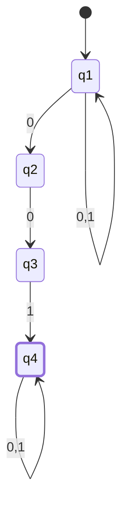
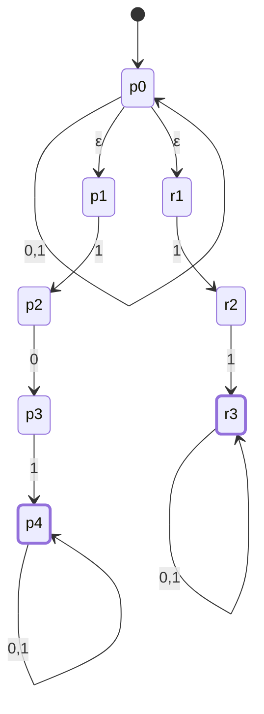
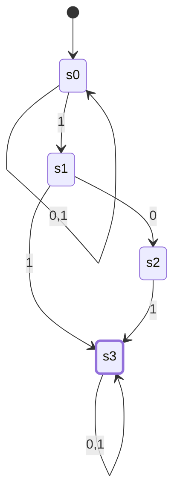
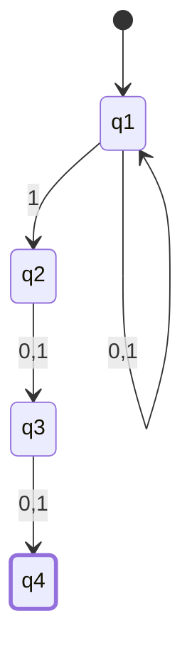
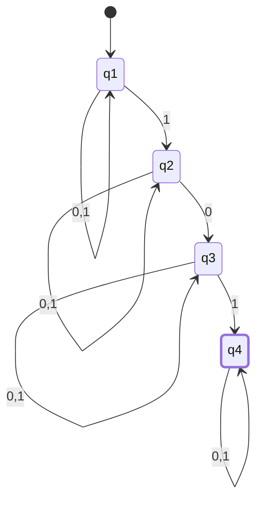
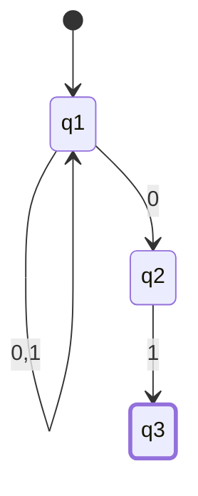
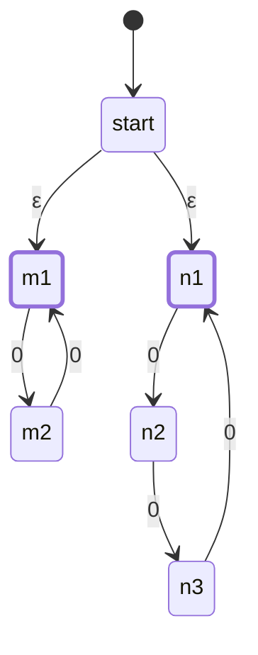
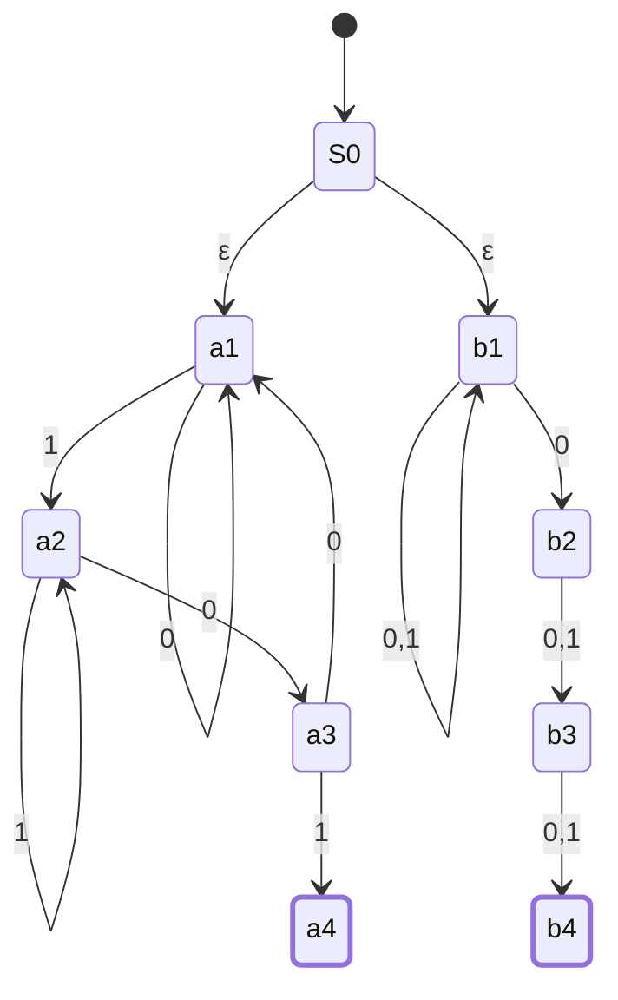
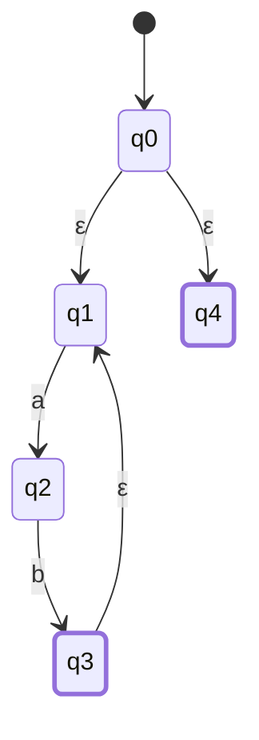
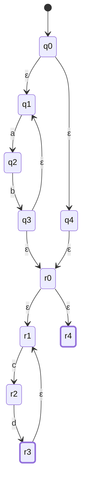

# CSE331 — Lecture 5: NFA Introduction

## NFA (Non-deterministic Finite Automaton)

Three defining properties (contrast with DFA):
1. Only the required transitions need to be shown (not all inputs from every state).
2. The same input from a state can transition to multiple states.
3. Can transition between states on empty input ($\varepsilon$).

## NFA Examples

### Contains 001 as substring
Linear chain of 4 states on inputs 0, 0, 1 with self-loops ($\{0,1\}$) at the start and accepting states.

### Contains either 101 or 11 as substring
Branching NFA from a single start state via $\varepsilon$-transitions into two parallel chains — one recognizing `101`, the other recognizing `11` — each ending in its own accepting state.

**Alternative construction (own work, 2026-07-28):** instead of branching via ε at the very start into two separate chains, exploit the fact that "101" and "11" share the prefix "1" — merge them into a single shared chain that branches one symbol later, on whichever symbol comes *after* that shared "1".

*(s0: self-loop {0,1} skips any leading characters, nondeterministically branching on a "1" into s1 — same prefix trick as the ε-branch version and as "Contains 1 in the third-to-last position" below. s1: one "1" matched so far, shared by both patterns; on "0" progress toward "101" via s2, on "1" jump straight to s3 — "11" already matched. s2: "10" matched, one more "1" completes "101" into s3. s3: accepting, with a {0,1} self-loop to absorb any trailing characters.)*

### Contains 1 in the third-to-last position
Linear chain: self-loop $\{0,1\}$ at start, then `1`, then two more transitions on $\{0,1\}$ to the accepting state.

*(Nondeterministic at q1: on input 1, the NFA can either stay via the self-loop or move to q2 — that branching is what "guesses" the third-to-last position.)*

### Subsequence "101"
Chain of 4 states: self-loop $\{0,1\}$, then transition on 1, self-loop $\{0,1\}$, transition on 0, self-loop $\{0,1\}$, transition on 1, final self-loop $\{0,1\}$ at accepting state.

### Ends in "01"
3-state chain: self-loop $\{0,1\}$ at start, transition on 0, transition on 1 to accepting state.

## Set Difference

$$L_1 \setminus L_2 = L_1 \cap \overline{L_2}$$

Illustrated with a Venn diagram (shaded region = $L_1$ minus the overlap with $L_2$).

## Closure Under the Regular Operations

Closure analogy: just as Integer + Integer = Integer, combining two regular languages with a regular operation (union, concatenation, Kleene star) always yields another regular language — Regular Language op Regular Language = Regular Language. The constructions below build a new finite automaton (DFA or NFA — both still finite) from the two component machines, which is exactly what makes the result regular.

> [!important] Confirmed Mid-Term proof topic
> TNF confirmed proof questions on closure under Union, Concatenation, and Kleene Star may appear on the Mid-Term (see `cse331_exam_notes.md`, Proof-of-correctness guidance table). Proof by a specific example language is explicitly **not accepted** — answer with the general construction below, in terms of arbitrary $M_1$ (NFA for $L_1$) and $M_2$ (NFA for $L_2$). No formal notation is required; explaining how the transitions, start state, and accepting states are constructed is sufficient.

> On the exam itself, TNF's stated bar is just the construction step, described in words — the full correctness argument below is for understanding, not something you need to reproduce end to end under time pressure.

### Union ($L_1 \cup L_2$)

**Claim:** if $L_1$ and $L_2$ are regular, then $L_1 \cup L_2$ is regular.

**Given:** since $L_1, L_2$ are regular, there exist NFAs $M_1 = (Q_1, \Sigma, \delta_1, q_1, F_1)$ recognizing $L_1$ and $M_2 = (Q_2, \Sigma, \delta_2, q_2, F_2)$ recognizing $L_2$, with $Q_1$ and $Q_2$ disjoint (rename states if needed).

**Construction:** build $M = (Q, \Sigma, \delta, q_0, F)$ where:
- $Q = Q_1 \cup Q_2 \cup \{q_0\}$, with $q_0$ a fresh state.
- $\delta(q_0, \varepsilon) = \{q_1, q_2\}$ — the only transitions out of $q_0$.
- For every $q \in Q_1$, $\delta(q,a) = \delta_1(q,a)$; for every $q \in Q_2$, $\delta(q,a) = \delta_2(q,a)$ — each machine's own transition table carried over completely unchanged.
- $F = F_1 \cup F_2$.

**Correctness — $L(M) = L_1 \cup L_2$:**
- ($L_1 \cup L_2 \subseteq L(M)$) Take any $w \in L_1 \cup L_2$. Say $w \in L_1$ (the $L_2$ case is symmetric). Since $M_1$ accepts $w$, there is a run of $M_1$ from $q_1$ to some state in $F_1$ consuming $w$. Because $M$ preserves every transition of $M_1$ unchanged and has a free $\varepsilon$-move from $q_0$ into $q_1$, that exact same run exists in $M$, starting with $q_0 \xrightarrow{\varepsilon} q_1$. It ends in $F_1 \subseteq F$, so $M$ accepts $w$.
- ($L(M) \subseteq L_1 \cup L_2$) Take any $w$ accepted by $M$. The accepting run starts at $q_0$, whose only moves are the two $\varepsilon$-edges into $q_1$ or $q_2$ — so the run must enter $Q_1$ or $Q_2$ immediately. Since $Q_1$ and $Q_2$ are disjoint and no transition crosses between them (every transition inside $Q_1$ only ever leads to $Q_1$, and likewise for $Q_2$), the run stays entirely inside whichever half it entered. If it stayed in $Q_1$: it must end in a state of $F \cap Q_1 = F_1$, which is exactly an accepting run of $M_1$ on $w$ — so $w \in L_1$. Symmetric argument if it stayed in $Q_2$: $w \in L_2$. Either way $w \in L_1 \cup L_2$.

Both inclusions hold, so $L(M) = L_1 \cup L_2$. $M$ is a finite NFA over $\Sigma$, so $L_1 \cup L_2$ is regular. $\blacksquare$

*(Equivalent alternative: the DFA cross-product construction on $Q_1 \times Q_2$ — see the fully worked derivation in [CSE331_lecture_04_2026-06-22](CSE331_lecture_04_2026-06-22.md) — proves the same claim by the same style of argument: a pair-state is reached on input $w$ exactly when each component would independently be in that state on $w$, so marking every pair containing an $F_1$- or $F_2$-state as accepting reproduces $L_1 \cup L_2$ directly, with no $\varepsilon$/nondeterminism needed at all.)*

### Concatenation ($L_1 . L_2$)

**Claim:** if $L_1$ and $L_2$ are regular, then $L_1 . L_2$ is regular.

**Given:** NFAs $M_1 = (Q_1, \Sigma, \delta_1, q_1, F_1)$ for $L_1$ and $M_2 = (Q_2, \Sigma, \delta_2, q_2, F_2)$ for $L_2$, $Q_1$ and $Q_2$ disjoint.

**Construction:** build $M = (Q, \Sigma, \delta, q_1, F)$ where:
- $Q = Q_1 \cup Q_2$ (start state is $M_1$'s own start, $q_1$ — no new state needed here).
- For every $q \in Q_1$: $\delta(q,a) = \delta_1(q,a)$, and additionally, if $q \in F_1$, add $\delta(q, \varepsilon) \ni q_2$ (an extra $\varepsilon$-move into $M_2$'s start, on top of $M_1$'s existing transitions).
- For every $q \in Q_2$: $\delta(q,a) = \delta_2(q,a)$, unchanged.
- $F = F_2$ — only $M_2$'s original accepting states remain accepting; $M_1$'s accepting states are **not** included in $F$.

**Correctness — $L(M) = L_1 . L_2$:**
- ($L_1.L_2 \subseteq L(M)$) Take $w = xy$ with $x \in L_1$, $y \in L_2$. $M_1$ has a run on $x$ from $q_1$ to some $f_1 \in F_1$; that run exists unchanged inside $M$. From $f_1$, take the new $\varepsilon$-edge into $q_2$ at no input cost, then follow $M_2$'s run on $y$ from $q_2$ to some $f_2 \in F_2 = F$. Concatenating these two runs consumes exactly $xy = w$ and ends in $F$, so $M$ accepts $w$.
- ($L(M) \subseteq L_1.L_2$) Take any $w$ accepted by $M$. Since $F = F_2 \subseteq Q_2$, the accepting run must end inside $Q_2$. Because the only edges from $Q_1$ into $Q_2$ are the $\varepsilon$-edges placed at $M_1$'s accepting states, the run must cross from $Q_1$ into $Q_2$ through one of those $\varepsilon$-edges (or start directly in $Q_2$ only if $q_1 \in Q_2$, which can't happen since $Q_1, Q_2$ are disjoint and $M$ starts at $q_1 \in Q_1$). So the run splits into: a prefix run inside $Q_1$ from $q_1$ to some $f_1 \in F_1$ consuming some prefix $x$ of $w$ — i.e. $x \in L_1$ — followed by the free $\varepsilon$-jump, followed by a run inside $Q_2$ from $q_2$ to some $f_2 \in F_2$ consuming the rest, $y$ — i.e. $y \in L_2$. So $w = xy$ with $x \in L_1, y \in L_2$, i.e. $w \in L_1.L_2$.

Both inclusions hold, so $L(M) = L_1.L_2$, and since $M$ is a finite NFA, $L_1.L_2$ is regular. $\blacksquare$

**Expected exam format (TNF, Discord, 2026-07-27):** concatenation questions are normally expected as an **NFA**, built with the construction above. A direct **DFA** for concatenation is only expected for the one specific pattern given in the assignment — for any other pattern, build the NFA; only convert it to a DFA afterward (via subset construction) if the question explicitly asks for a DFA.

### Kleene Star ($L^*$)

**Claim:** if $L$ is regular, then $L^*$ is regular.

**Given:** an NFA $M_1 = (Q_1, \Sigma, \delta_1, q_1, F_1)$ recognizing $L$.

**Construction:** build $M = (Q, \Sigma, \delta, q_0, F)$ where:
- $Q = Q_1 \cup \{q_0\}$, $q_0$ a fresh state.
- $\delta(q_0, \varepsilon) = \{q_1\}$ — allows entering $M_1$ to attempt one pass.
- For every $q \in Q_1$: $\delta(q,a) = \delta_1(q,a)$, and additionally, if $q \in F_1$, add $\delta(q,\varepsilon) \ni q_1$ (loop back to $M_1$'s original start on top of existing transitions).
- $F = F_1 \cup \{q_0\}$ — $q_0$ itself is accepting, to capture $\varepsilon$ directly, alongside $M_1$'s original accepting states.

**Correctness — $L(M) = L^*$:** recall $L^* = \{\varepsilon\} \cup \{x_1x_2\cdots x_k : k \ge 1,\ \text{each } x_i \in L\}$.
- ($L^* \subseteq L(M)$) The empty string: $q_0 \in F$, so $M$ accepts $\varepsilon$ immediately with zero moves. For $w = x_1\cdots x_k$ with each $x_i \in L$, $k\ge1$: start with $q_0 \xrightarrow{\varepsilon} q_1$, run $M_1$ on $x_1$ to reach some $f \in F_1$, take the loop-back $\varepsilon$-edge to $q_1$ again, run $M_1$ on $x_2$, and so on. After the final block $x_k$ the run ends in $F_1 \subseteq F$. This consumes all of $w$ and ends accepting, so $M$ accepts $w$.
- ($L(M) \subseteq L^*$) Take any $w$ accepted by $M$. If the run never leaves $q_0$ (no input consumed), $w = \varepsilon \in L^*$. Otherwise the run leaves $q_0$ via the one $\varepsilon$-edge into $q_1$, and from there stays inside $Q_1$ except for possible loop-back $\varepsilon$-jumps at $F_1$-states back to $q_1$. Each stretch between consecutive visits to $q_1$ is exactly a run of $M_1$ from $q_1$ to some $f \in F_1$ — i.e. it consumes some block $x_i \in L$. Splitting the run at every loop-back point breaks $w$ into $x_1 x_2 \cdots x_k$, $k \ge 1$, each $x_i \in L$ (the run must end at an $F_1$-state, since $Q$'s only other accepting state is $q_0$, unreachable again once left). So $w \in L^*$.

Both inclusions hold, so $L(M) = L^*$, and since $M$ is a finite NFA, $L^*$ is regular. $\blacksquare$

## Worked Examples of Closure Constructions

Concrete instantiations of the general constructions above, with actual states and symbols.

### Union — mod-2 ∪ mod-3 ($\varepsilon$-branching NFA)

$L_1 = 0^n$, $n=2k$ (all-zero strings of even length: $\varepsilon, 00, 0000, \dots$) $\;\cup\;$ $L_2 = 0^n$, $n=3k$ (all-zero strings of length a multiple of 3: $\varepsilon, 000, 000000, \dots$).

NFA built with an $\varepsilon$-branching start state into two independent sub-automata run in parallel — a mod-2 cycle for $L_1$, a mod-3 cycle for $L_2$ — accepting if *either* branch ends the string in its own accepting state. Neither branch defines a transition on input 1, so any string containing a 1 is rejected on every path (consistent with $L_1, L_2 \subseteq 0^*$).

*(m1/m2: mod-2 cycle, accepting at m1 = "even count of 0s read so far." n1/n2/n3: mod-3 cycle, accepting at n1 = "count of 0s ≡ 0 (mod 3)." A string is accepted if either branch independently reaches its own accepting state after consuming the whole string.)*

### Union — substring 101 ∪ third-to-last position 0

$L_1 \cup L_2$ ($L_1$ = substring 101, $L_2$ = contains 0 in third-last position).

Union NFA combining a "substring 101" component with a "0 in third-to-last position" component via $\varepsilon$-transitions — same multi-path union pattern as the mod-2/mod-3 example above, applied to two different component languages.

*(a-branch = "contains substring 101" NFA from [CSE331_lecture_02_2026-06-15](CSE331_lecture_02_2026-06-15.md); b-branch = "0 in third-to-last position," built the same way as the "1 in third-to-last position" NFA above with the symbol swapped. Joined at a new ε-branching start — same union pattern as the mod-2/mod-3 example just above.)*

### Kleene Star — $(ab)^*$

$(ab)^*$: zero or more repetitions of "ab".

Construction: start $\xrightarrow{\varepsilon}$ state $\xrightarrow{a}$ state $\xrightarrow{b}$ accepting state, with an $\varepsilon$-transition back from the accepting state to the start of the `a`-`b` chain (looping), and an $\varepsilon$ path from start directly to a second accepting state (to allow zero repetitions).

### Kleene Star chained with Concatenation — $(ab)^*(cd)^*$

Chaining two Kleene-starred sub-languages via $\varepsilon$-transitions.

*(Two copies of the $(ab)^*$ fragment above, second one relabeled for `c`/`d`, chained by routing both of the first fragment's accepting states ($q_3$, $q_4$) via ε into the second fragment's start ($r_0$).)*

## Anki Cards

START
Basic
What are the three defining properties of an NFA that distinguish it from a DFA?
Back: (1) Only required transitions need to be shown. (2) The same input from a state can go to multiple states. (3) Transitions on empty input (ε) are allowed.
END

START
Basic
How is set difference (L₁ \ L₂) expressed in terms of intersection and complement?
Back: L₁ \ L₂ = L₁ ∩ complement(L₂).
END

START
Basic
In the Kleene star NFA construction for (ab)*, why is there an ε-transition directly from the start state to an accepting state?
Back: To allow the "zero repetitions" case — the empty string ε must be accepted since Kleene star includes zero or more repetitions.
END
