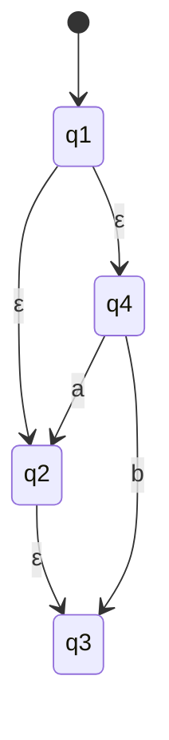
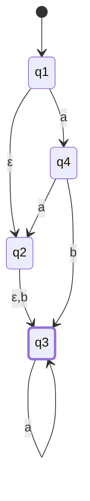
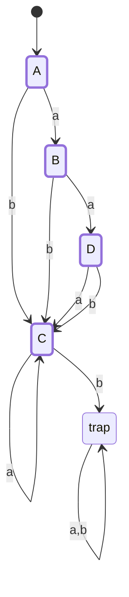

# CSE331 — Lecture 6: NFA to DFA (Subset Construction)

## Power Set

**Why this comes first:** subset construction builds a DFA whose states are *subsets* of the NFA's state set — each DFA state literally is some subset of $\{q_1, \dots, q_n\}$. Since a set of $n$ elements has $2^n$ possible subsets, this immediately gives the hard ceiling on how large the resulting DFA can ever get: at most $2^n$ states, one per possible subset (see "Bounds on Subset Construction" below). This warm-up exists to make that ceiling concrete before applying it.

$$|\{a,b,c,d\}| = n \text{ elements} \Rightarrow 2^n \text{ subsets}$$

$$\mathcal{P}(\{a,b,c,d\}) \supseteq \{\emptyset, \{a\}, \{b\}, \{c\}, \{d\}, \dots\}$$

## $\varepsilon$-Closure

**Definition:** the ε-closure of a state $q$ is the set of every state reachable from $q$ using only ε-transitions (zero or more of them), including $q$ itself.

**Why it has to be computed before subset construction:** an NFA can move between states "for free" via ε, without consuming any input. So being "at" a single state $q$ after reading some input actually means the machine could simultaneously be at any state reachable from $q$ via ε — all of that has to be swept in before the next real symbol is read, or reachable NFA states get silently dropped from the resulting DFA. This is why every DFA state built below is a *closure*, not just a raw set of NFA states: the start state is closure(NFA start), and every transition target is closure(raw NFA move), never the raw move alone.

**Example NFA:** states $q_1, q_2, q_3, q_4$.
- $q_1 \xrightarrow{\varepsilon} q_2$
- $q_1 \xrightarrow{\varepsilon} q_4$
- $q_4 \xrightarrow{a} q_2$
- $q_2 \xrightarrow{\varepsilon} q_3$
- $q_4 \xrightarrow{b} q_3$ (a real `b` transition, not part of the ε-closure)

*(No accepting state marked here — this example is purely about computing ε-closures, not language recognition.)*

$\varepsilon$-closures computed:
$$q_1 = \{q_1, q_2, q_4, q_3\}, \quad q_2 = \{q_2, q_3\}, \quad q_3 = \{q_3\}, \quad q_4 = \{q_4\}$$

### Second worked NFA (transition table build-up)

States $q_1, q_2, q_3, q_4$:
- $q_1 \xrightarrow{\varepsilon} q_2$, $q_1 \xrightarrow{a} q_4$
- $q_4 \xrightarrow{a} q_2$, $q_4 \xrightarrow{b} q_3$
- $q_2 \xrightarrow{\varepsilon, b} q_3$
- $q_3$ self-loop on $a$

*(q3 marked accepting per the `* q3` row in the NFA transition table below.)*

$\varepsilon$-closures:
$$q_1 = \{q_1, q_2, q_3\}, \quad q_2 = \{q_2, q_3\}, \quad q_3 = \{q_3\}, \quad q_4 = \{q_4\}$$

**NFA Transition Table** ($\delta(\{\text{states}\}, \text{input})$):

| State | a | b |
|---|---|---|
| → $q_1$ | $\{q_4\}$ | $\emptyset$ |
| $q_2$ | $\emptyset$ | $\{q_3\}$ |
| * $q_3$ | $\{q_3\}$ | $\emptyset$ |

**DFA Transition Table** (subset construction result):

| States | a | b |
|---|---|---|
| * $\{q_1, q_2, q_3\}$ (A, start) | $\{q_3, q_4\}$ | $\{q_3\}$ |
| * $\{q_3, q_4\}$ | $\{q_2, q_3\}$ | $\{q_3\}$ |
| * $\{q_3\}$ | $\{q_3\}$ | $\emptyset$ (trap) |
| * $\{q_2, q_3\}$ | $\{q_3\}$ | $\{q_3\}$ |

(All listed states marked with `*` are accepting, since each contains the NFA's accepting state $q_3$.)

*(Renamed for readability: A = {q1,q2,q3} (start), B = {q3,q4}, C = {q3}, D = {q2,q3}, trap = ∅ (dead state, non-accepting) — matching the DFA transition table above exactly.)*

## Bounds on Subset Construction

Given NFA with $n$ states:
$$\text{Maximum states in resulting DFA} = 2^n$$
$$\text{Maximum accepting states} = 2^n - 2^{n-k}$$
$$\text{Maximum rejecting states} = 2^{n-k}$$

where $k$ = number of accepting states in the original NFA.

The actual resulting DFA can have fewer states than the full $2^n$ power-set bound, since unreachable subsets are dropped.

## Anki Cards

START
Basic
In subset construction (NFA → DFA), if the NFA has n states, what is the maximum number of states the resulting DFA can have?
Back: 2ⁿ — one for every possible subset of the NFA's state set (the power set).
END

START
Basic
Why can the actual DFA produced by subset construction have fewer than 2ⁿ states?
Back: Only the subsets that are actually reachable from the start state's ε-closure via some input sequence get included in the final DFA — unreachable subsets are dropped.
END

START
Basic
In subset construction, which subset-states in the resulting DFA are marked as accepting?
Back: Any subset that contains at least one of the original NFA's accepting states.
END
