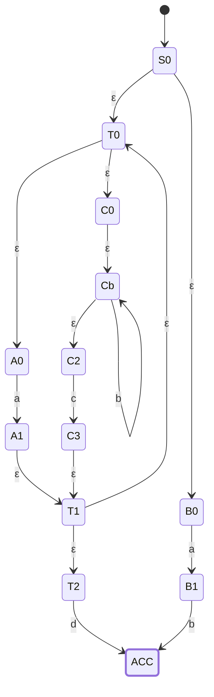
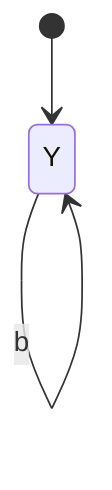
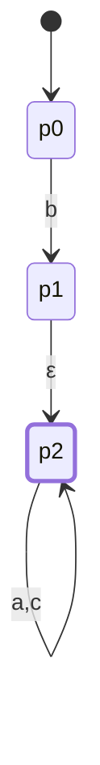

# CSE331 — Lecture 8: Regular Expressions (cont.) & RE → NFA

## More Complement Examples

**Length is at least 3** — complement: **length is at most 2**.

**Length is at most 3** — complement: **length is at least 4**.

(Consistent with the general pattern: complementing a length bound flips ≥ ↔ < and swaps the boundary by one.)

## Alternating 0s and 1s

**Contains 0 and 1 alternately** (starting with either symbol):
$$(\varepsilon \cup 1)(01)^*(\varepsilon \cup 0)$$
Alternatively:
$$(\varepsilon \cup 0)(10)^*(1 \cup \varepsilon)$$

## Doesn't Contain a Fixed Substring

**Doesn't contain `11`:**
$$(1 \cup \varepsilon)(01 \cup 0)^*$$
Alternatively:
$$(0 \cup 10)^*(1 \cup \varepsilon)$$

Expansion sanity check on the second form — repeating the block $(0\cup10)$ never introduces two consecutive 1's, since every `1` in a block is immediately followed by the start of the next block (which is either `0` or `10`, never another `1`):
$$(0\cup10)(0\cup10)(0\cup10)(0\cup10)\cdots \to \text{e.g. } 0,\ 0,\ 10,\ 0,\ \ldots$$

**Doesn't contain `111`:**
$$(0 \cup 10 \cup 110)^*(\varepsilon \cup 11 \cup 1)$$

## De Morgan's Law on Regular Expressions

$$\overline{A \cup B} = \bar{A} \cap \bar{B}$$
$$\overline{L_1 \cap L_2} = \bar{L_1} \cup \bar{L_2}$$

De Morgan's Law holds for regular expressions/languages the same way it holds for sets — complement of a union is the intersection of complements, and vice versa.

## RE → NFA (Thompson's Construction)

Worked example — same regex written in two equivalent notations (`∪`/`*` vs. `+`/`*`, both mean the same thing, "same question"):
$$(a \cup b^*c)^*d \cup ab \qquad \equiv \qquad (a+b^*c)^*d + ab$$

**Structure of the NFA** (Thompson's construction, reconstructed from the scan):

- A single start state splits via **ε-transitions** into two parallel branches — one per top-level union operand: `(a∪b*c)*d` and `ab`.
- **Top branch** — `(a∪b*c)*d`:
  - The Kleene-star wraps a union, so the loop body itself ε-splits into two sub-paths:
    - Path 1: ε → state --a--> state → ε (rejoins the loop-back point)
    - Path 2: ε → state --b*c--> — realized as a `b`-loop (ε into a self-loop on `b`, ε back out) followed by a `c` transition → ε (rejoins the loop-back point)
  - The loop-back ε returns to the top of the union so the star can repeat zero or more times.
  - After the star, ε leads into a `d` transition into the (shared) accepting state.
- **Bottom branch** — `ab`:
  - ε → state --a--> state --b--> accepting state.
- Both branches terminate at the same double-circled accepting state.

*(T0 = loop-entry/union point, T1 = rejoin point after either path, T2 = star-exit before `d`. Built via the standard Thompson rules from the regex itself, matching the branch-by-branch description above.)*

**Alternative fragment for `b*`** (noted separately in the margin as a simpler equivalent way to draw a Kleene star on a single symbol, instead of the full ε-based Thompson fragment): a state with a self-loop labeled `b`, entered via a `b` transition and exiting directly — i.e. `state --b--> state` with a `b` self-loop on the second state, replacing the two-ε-transition detour.

*(The margin note as transcribed — a two-state `state --b--> state` fragment — actually encodes `b+` (one-or-more), not `b*`. The correct one-state shortcut treats the same state as both entry and exit: arriving at Y, the fragment can be left immediately (zero b's) or after looping the self-loop any number of times (one or more b's), which is what makes it interchangeable with the full ε-based fragment above.)*

**Confirmed acceptable (TNF, Discord, 2026-07-27 to 2026-07-28):** using this self-loop shortcut in place of the full ε-based fragment is fine on RE→NFA questions, even when the starred term is only part of a larger expression. Example: for `b(a+c)*` below, draw a single required `b`-edge for the leading `b`, then connect it via ε into a self-loop-shortcut state for `(a+c)*`; concatenation between the two pieces is carried by that connecting ε-edge, not by consuming any extra input. Also confirmed: for a regex like `(a+b)^+`, it's fine to treat and draw it as `(a+b)(a+b)*` — one required copy followed by the starred remainder, the same "one required piece, then star" pattern as below.

*(p0 --b--> p1: the one required `b`, consumed exactly once — every accepted string must start with it. p1 --ε--> p2: the connecting/concatenation edge, no input consumed, just entry into the star fragment. p2: the self-loop-shortcut fragment for `(a+c)*` — a single state serving as both entry and exit, self-looping on `a` and `c`, so it accepts zero or more repetitions of either symbol in any order. Together: exactly one `b`, followed by any mix of `a`s and `c`s — e.g. `b`, `bac`, `baaacc` are all accepted; `ac` is not, since there's no way to reach p1 without first consuming `b`.)*

## Anki Cards

START
Basic
What is the complement of "length is at least 3" over a fixed alphabet?
Back: "Length is at most 2" — complementing a ≥ bound gives the strict complement below it.
END

START
Basic
State De Morgan's Law for regular languages, for both union and intersection.
Back: $\overline{A\cup B} = \bar{A}\cap\bar{B}$ and $\overline{L_1\cap L_2} = \bar{L_1}\cup\bar{L_2}$ — same as set De Morgan's, applies directly to regular expressions/languages.
END

START
Basic
Write a regex for "doesn't contain 11" over {0,1}.
Back: $(0\cup10)^*(1\cup\varepsilon)$ — repeating the block $(0\cup10)$ can never produce two consecutive 1's, since every 1 starts a new block.
END

START
Basic
In Thompson's construction, how is a top-level union $R_1 \cup R_2$ converted to an NFA?
Back: A new start state ε-splits into the start of $R_1$'s NFA and the start of $R_2$'s NFA; both accepting states are typically ε-merged into one shared accepting state (or ε-joined into a new one).
END
