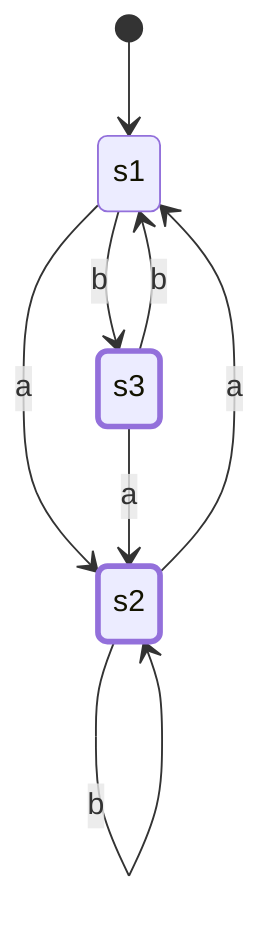
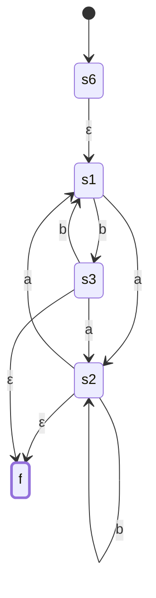
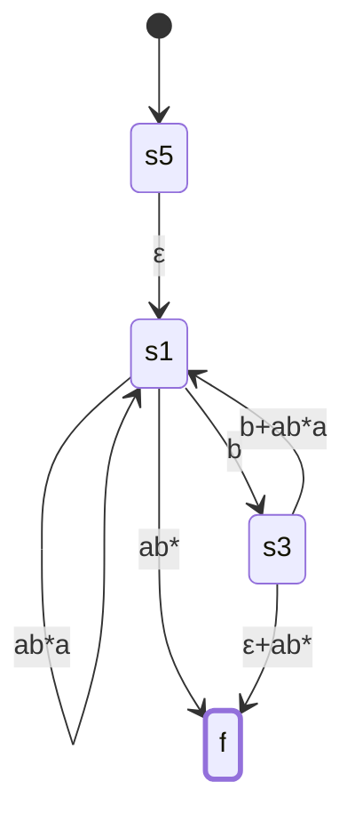
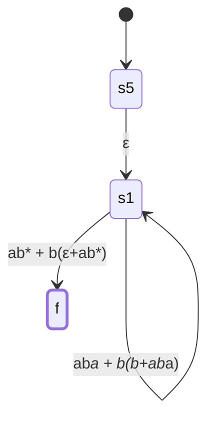

# CSE331 — Lecture 9: Converting FA to RE (State Elimination / GNFA Method)

## Overview

Converting a DFA/NFA to an equivalent regular expression via the **Generalized NFA (GNFA)** state elimination method.

Pipeline: **DFA → NFA → GNFA** (generalized — edges may be labeled with full regular expressions, not just single symbols/ε).

Small illustration of a GNFA edge label: a single state with a self-loop labeled `a` and an outgoing edge labeled `cb*` — showing that in a GNFA a transition can carry an entire regex, e.g. an overall target shape like start --`(a+b*)cd`--> accept.

## Order of Elimination

Elimination order used in the worked example below: **state 2, then state 3, then state 1** (leaving only start and accept).

## Pre-processing: DFA/NFA → GNFA

A GNFA needs a specific shape before state elimination can begin:

1. **Start state must have no incoming edges.** If it does, add a new start state with a single ε-transition into the old start state.
2. **Exactly one accepting state.** If there are multiple, add one new accepting state, connect each old accepting state to it via ε-transitions, and demote the old ones.
3. **Accepting state must have no outgoing edges.** If it does, demote it and add an ε-transition to a new dedicated accept state with no outgoing edges.

## Additional Rules (TNF, Discord clarifications, 2026-07-24 to 2026-07-28)

- **A self-loop on the start state counts as an incoming edge.** Rule 1 still applies even if the only edge into the start state is its own self-loop — a new start state must still be added.
- **Preprocessing doesn't have to happen all upfront.** You don't need to fully satisfy all three shape rules before eliminating anything. If the state you need to eliminate next turns out to be the current start state or an accepting state, add the new start/accept state at that point in the process instead. The only hard requirement is that **by the end, exactly two states remain: the new start and the new accept.**
- **If the state being eliminated has no incoming edge or no outgoing edge, just delete it outright — do not apply the elimination formula.** No incoming or no outgoing edge means no string can ever be accepted through that state, so there is nothing to preserve; no new transitions are added in its place.

## Worked Example

**Original DFA** (state 1 = start, states 2 **and** 3 = accepting; alphabet {a, b}):

- 1 --a--> 2
- 1 --b--> 3
- 2 --a--> 1
- 2 --b--> 2 (self-loop)
- 3 --a--> 2
- 3 --b--> 1
- States **2 and 3** are both accepting.

*(Renamed 1/2/3 → s1/s2/s3 for the diagram — Mermaid state names can't be bare digits.)*

**Pre-processed into GNFA form** (new start state 6, new accept state f; rule 2 applies since there were two accepting states — both 2 and 3 get a new ε-edge to f):

- 6 --ε--> 1
- 1 --a--> 2
- 1 --b--> 3
- 2 --a--> 1
- 2 --b--> 2 (self-loop)
- 2 --ε--> f
- 3 --a--> 2
- 3 --b--> 1
- 3 --ε--> f

## State Elimination

General rule: eliminating state *q* replaces every incoming/outgoing pair (p, r) with a new direct edge labeled
$$\text{old\_label}(p,r) \;\cup\; \text{label}(p,q)\cdot\text{label}(q,q)^*\cdot\text{label}(q,r)$$

**Eliminating state 2:**
Incoming to 2: {1, 3} (via 1--a-->2 and 3--a-->2). Outgoing from 2: {1, f} (via 2--a-->1 and 2--ε-->f). Pairs: (1,1), (1,f), (3,1), (3,f).

- 1 → 1: `old(1,1) ∪ a·b*·a` = ∅ ∪ `ab*a` = `a b* a`
- 1 → f: `old(1,f) ∪ a·b*·ε` = ∅ ∪ `ab*` = `a b*`
- 3 → 1: `old(3,1) ∪ a·b*·a` = `b` ∪ `ab*a` = `b + a b* a`
- 3 → f: `old(3,f) ∪ a·b*·ε` = `ε` ∪ `ab*` = `ε + a b*`

The direct edge 1--b-->3 doesn't route through state 2, so it survives unchanged.

Resulting 3-state GNFA (5 = start, 1, 3, f):
- 5 --ε--> 1
- 1 --(`a b* a`)--> 1 (self-loop)
- 1 --(`a b*`)--> f
- 1 --(`b`)--> 3 (unchanged original edge)
- 3 --(`b + a b* a`)--> 1
- 3 --(`ε + a b*`)--> f

*(This resolves the direction ambiguity previously flagged here: the two combined labels are both edges **from** 3 — to 1 and to f — while the plain `b` edge from 1 to 3 is the original, untouched transition. All three formulas above check out against `old_label(p,r)` values read directly off the corrected pre-processed GNFA.)*

**Eliminating state 3:**
Incoming to 3: {1} (via the surviving `1--b-->3` edge). Outgoing from 3: {1, f} (the two combined labels above). No self-loop on 3, so `label(3,3)* = ε`. Pairs: (1,1), (1,f).

- 1 → 1 (self-loop): `old(1,1) ∪ b·ε·(b+ab*a)` = `ab*a` ∪ `b(b+ab*a)` = `a b* a + b(b + a b* a)`
- 1 → f: `old(1,f) ∪ b·ε·(ε+ab*)` = `ab*` ∪ `b(ε+ab*)` = `a b* + b(ε + a b*)`

Resulting 2-state GNFA:
- 5 --ε--> 1
- 1 --(`a b* a + b(b + a b* a)`)--> 1 (self-loop)
- 1 --(`a b* + b(ε + a b*)`)--> f

**Eliminating state 1** (last internal state) collapses directly to a single start→accept edge:

$$\text{start} \xrightarrow{\;(ab^*a+b(b+ab^*a))^*\,(ab^*+b(\varepsilon+ab^*))\;} \text{accept}$$

## Final Regular Expression

$$RE = \big(ab^*a + b(b+ab^*a)\big)^* \big(ab^* + b(\varepsilon+ab^*)\big)$$

## Anki Cards

START
Basic
What is the required shape of a GNFA before state elimination can begin?
Back: (1) Start state has no incoming edges, (2) exactly one accepting state, (3) the accepting state has no outgoing edges. Add new start/accept states with ε-transitions as needed to enforce this.
END

START
Basic
When eliminating a state q from a GNFA, how is the new edge label between an incoming state p and outgoing state r computed?
Back: new_label(p,r) = old_label(p,r) ∪ label(p,q)·label(q,q)*·label(q,r) — the direct edge unioned with the path that goes only through q, looping on q's self-label zero or more times.
END

START
Basic
In the FA→RE state elimination method, when does the process stop and what is the answer?
Back: Stop when only the start and accept states remain (all other states eliminated one at a time). The label on the final start→accept edge is the resulting regular expression.
END
