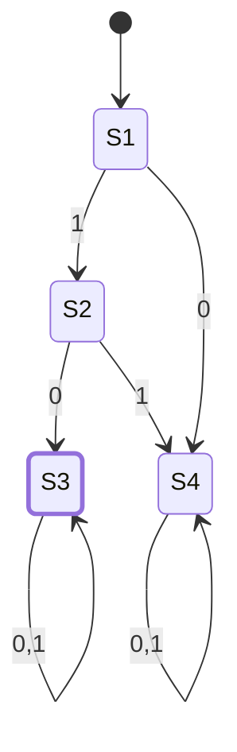

# CSE331 — Lecture 13: Designing CFGs — Worked Examples

Continues Topic 10 (CFG definition) from Lecture 12, moving from formal definition into practical CFG-construction technique through worked examples. No new topic number introduced — this is design practice within Topic 10, directly relevant to Assignment 2 Part A (CFG writing).

## Building a CFG from a DFA/RE (regular language: "starts with 10")

> [!info] Not a must, but to design a CFG, we can use the idea of an existing DFA/RE for the same language.

### DFA

Language: strings over $\{0,1\}$ that **start with 10**.

- $S_1$: start state. On `1` → $S_2$. On `0` → $S_4$ (trap).
- $S_2$: on `0` → $S_3$ (accept). On `1` → $S_4$ (trap).
- $S_3$: accepting, self-loops on `0` and `1` (anything can follow).
- $S_4$: trap state, self-loops on `0` and `1`, non-accepting.

### DFA → grammar (right-linear / regular grammar technique)

Each accepting transition becomes a production; each transition $p \xrightarrow{a} q$ becomes $p \to a\,q$; an accepting state gets $p \to \varepsilon$ as an option. Only the accepting path ($S_1 \to S_2 \to S_3$) is needed since $S_4$ is a dead end:

$$S_1 \to 1S_2$$
$$S_2 \to 0S_3$$
$$S_3 \to 0S_3 \mid 1S_3 \mid \varepsilon$$

> [!note] This is the standard technique for converting any DFA into an equivalent right-linear CFG — consistent with $RL \subsetneq CFL$ from Lecture 12: every regular language has *some* CFG, even though not every CFG describes a regular language.

### Building the same grammar from the regular expression

RE: $10\,\Sigma^*$, split into two building blocks — $X$ for the fixed prefix `10`, $Y$ for $\Sigma^*$:

$$S \to XY$$
$$X \to 10$$

Board work built $Y$ up in stages, first isolating each symbol separately, then combining:

$$Y \to \varepsilon \mid 0Y \quad \text{(generates } 0^* \text{ only)}$$
$$Y \to \varepsilon \mid 1Y \quad \text{(generates } 1^* \text{ only)}$$

Combined into the actual $\Sigma^*$ generator:

$$Y \to \varepsilon \mid 0Y \mid 1Y$$

> [!note] Rough step, not a formal claim: the boxed board note $Y \to (0,1)^* \to \varepsilon + 0^+ + 1^+$ was scaffolding toward the grammar above, not a literal decomposition of $\Sigma^*$ — taken as a set equality it would exclude every mixed string (e.g. `01`). The combined $Y \to \varepsilon\mid 0Y\mid 1Y$ is the one that actually generates full $\Sigma^*$, and is what $S \to XY$ relies on. Confirmed rough 2026-08-12.

## $\{0^n1^n : n \geq 0\}$ (not a regular language — Lecture 11)

$$S \to \varepsilon \mid 0S1$$

A small hand-drawn diagram beside this shows the string growing outward from the middle with each recursive step — reading it as: `01` → `0(01)1` = `0011` → `0(0011)1` = `000111`, captioned "a new 01 at the middle every time." Noting this as a rough sketch of how the recursion works rather than a formally separate construction — the exact intended tree shape in the scan is not fully certain.

## CFG of $S^*$ (Kleene star of an arbitrary CFG $S$)

$$Y \to \varepsilon \mid SY$$

Rough derivation shown on the board:

$$Y = S^* = \varepsilon + S^+ = \varepsilon + SS^* = \varepsilon \mid SY$$

## $\{a^ib^j : i > j\}$ — two constructions

**One way** — split $a^ib^j$ into $a^{i-j}$ (excess $a$'s, block $X$) followed by $a^jb^j$ (matched pairs, block $Y$):

$$S \to XY$$
$$X \to a \mid aX \quad \text{(generates } a^{i-j}\text{, at least one excess } a\text{)}$$
$$Y \to \varepsilon \mid aYb \quad \text{(generates matched } a^jb^j\text{)}$$

**Another way** — direct recursive construction:

$$S_2 \to a \mid aS_2 \quad \text{(the excess, unmatched } a\text{'s)}$$
$$S_1 \to aS_1b \mid S_2 \quad \text{(matched } a\,\_\,b \text{ pairs wrapped around the excess)}$$

Or, collapsing $S_2$ into $S_1$ directly:

$$S_1 \to aS_1b \mid a \mid aS_1$$

## $\{a^nb^{n+2} : n \geq 0\}$

$$S_1 \to aS_1b \mid bb$$

Base case ($n=0$): $S_1 \to bb$ gives $a^0b^2$. Each $aS_1b$ wrap preserves the $+2$ offset.

## $\{a^nb^{n+2} : n \geq 2\}$

Minimum enforced through the base case of $X$, rather than through $n \geq 0$:

$$S \to XY$$
$$X \to aXb \mid aabb$$
$$Y \to bb$$

$X$ alone generates $a^nb^n$ for $n \geq 2$ (base case is already $a^2b^2$); appending $Y = bb$ gives $a^nb^{n+2}$, $n \geq 2$.

## Palindrome CFG

$$S \to 0S0 \mid 1S1 \mid \varepsilon \mid 0 \mid 1$$

- $\varepsilon$ — handles **even-length** palindromes (empty middle).
- $0 \mid 1$ — handles **odd-length** palindromes (single middle character).

## Anki Cards

START
Basic
What is the general technique for converting a DFA into an equivalent right-linear CFG?
Back: For each transition $p \xrightarrow{a} q$, add production $p \to aq$. For each accepting state $p$, add $p \to \varepsilon$. Consistent with $RL \subsetneq CFL$ — every regular language has some CFG.
END

START
Basic
Give a CFG for the language of strings over $\{0,1\}$ starting with `10` (i.e. $10\Sigma^*$), built from two blocks $X$ and $Y$.
Back: $S \to XY$; $X \to 10$ (fixed prefix); $Y \to \varepsilon \mid 0Y \mid 1Y$ (generates $\Sigma^*$).
END

START
Basic
Give a CFG for $\{0^n1^n : n \geq 0\}$.
Back: $S \to \varepsilon \mid 0S1$.
END

START
Basic
Given a CFG variable $S$, how do you write a CFG rule for the Kleene star $S^*$ using a new variable $Y$?
Back: $Y \to \varepsilon \mid SY$. Derived from $S^* = \varepsilon + S^+ = \varepsilon + SS^*$.
END

START
Basic
Give a CFG for $\{a^ib^j : i > j\}$ using the split-into-two-blocks approach ($a^{i-j}$ excess, then matched $a^jb^j$).
Back: $S \to XY$; $X \to a \mid aX$ (excess $a$'s, at least one); $Y \to \varepsilon \mid aYb$ (matched pairs).
END

START
Basic
Give a single-variable (no helper block) CFG for $\{a^ib^j : i > j\}$.
Back: $S_1 \to aS_1b \mid a \mid aS_1$ — matched wraps, plus exactly one unmatched terminating $a$, plus optional extra unmatched $a$'s.
END

START
Basic
Give a CFG for $\{a^nb^{n+2} : n \geq 0\}$.
Back: $S_1 \to aS_1b \mid bb$. Base case $n=0$ gives $bb$ directly; each wrap preserves the $+2$ offset.
END

START
Basic
Give a CFG for $\{a^nb^{n+2} : n \geq 2\}$, and explain why the base case differs from the $n \geq 0$ version.
Back: $S \to XY$; $X \to aXb \mid aabb$; $Y \to bb$. The minimum $n=2$ is enforced by starting $X$'s base case at $a^2b^2$ (`aabb`) instead of $\varepsilon$, then appending the fixed $+2$ block $Y$.
END

START
Basic
Give the standard CFG for palindromes over $\{0,1\}$, and explain what each terminal production handles.
Back: $S \to 0S0 \mid 1S1 \mid \varepsilon \mid 0 \mid 1$. $\varepsilon$ handles even-length palindromes; $0 \mid 1$ handles odd-length palindromes (the single middle character).
END
