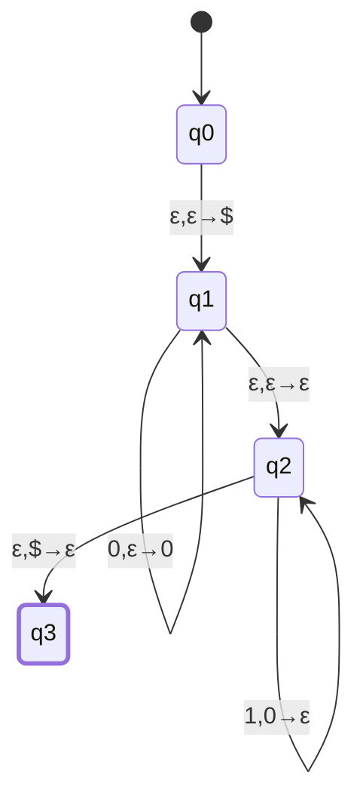
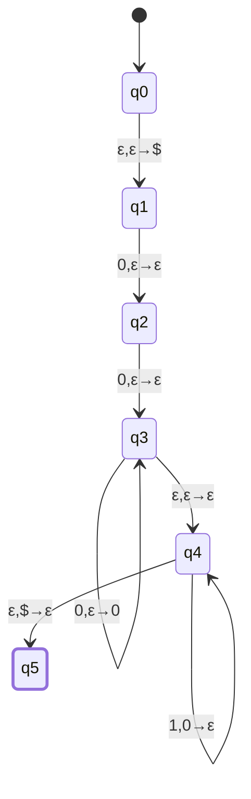
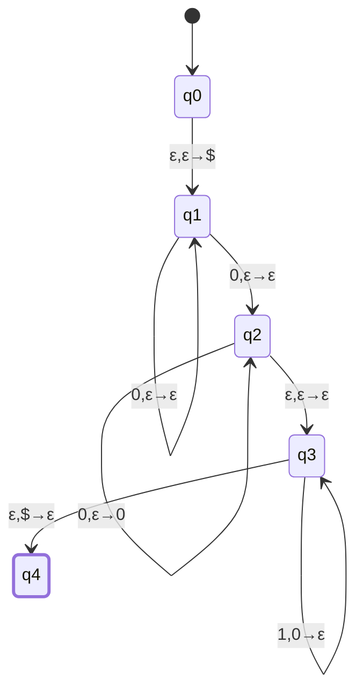
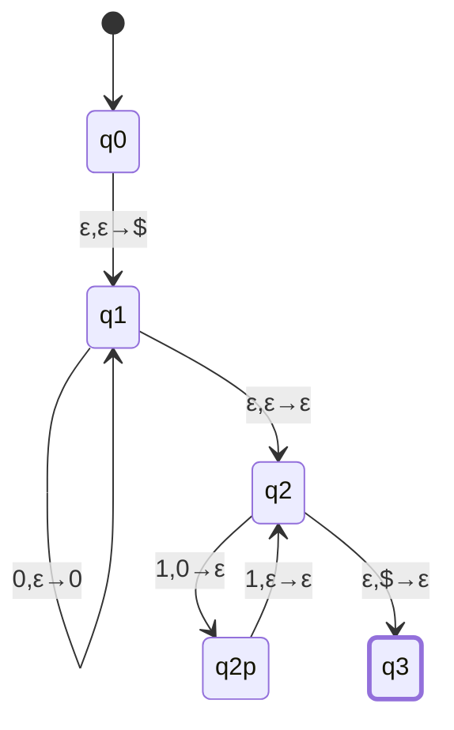

# CSE331 — Lecture 15: Pushdown Automata — Definition and Worked Examples

Opens Topic 13 (Pushdown Automata). A PDA recognizes context-free languages; informally, it is an NFA combined with a stack. Four worked constructions build up PDA design technique: exact match ($0^n1^n$), an additive offset ($0^{n+2}1^n$), a strict inequality ($0^n1^m, n>m$, two constructions), and an integer-multiple relation ($0^n1^{2n}$).

**Transition notation used throughout:** an edge labeled $a, b \to c$ means: on reading input symbol $a$ (or $\varepsilon$ for no input consumed), pop symbol $b$ (or $\varepsilon$ for no pop) off the stack, then push symbol $c$ (or $\varepsilon$ for no push).

## PDA components (7-tuple)

$$(Q, \Sigma, \Gamma, \delta, q_0, Z_0, F)$$

- $\Gamma$ — stack alphabet (the bottom marker $\$$ is included in $\Gamma$).
- $Z_0$ — the stack-start/stack-empty marker, $Z_0 = \$$.
- Acceptance is by **final state**: $F$ is the set of accepting states, and a string is accepted once it is fully consumed with the machine in a state $\in F$ — the stack's contents at that point don't matter. In several constructions below, popping down through $\$$ ($\varepsilon, \$ \to \varepsilon$) is used as a *technique* to gate entry into the accepting state (forcing the count-matching check to happen first), not a separate acceptance rule — see the note under $\{0^n1^m : n>m\}$ below, where the class confirms an earlier state could be marked accepting directly, without draining the stack at all.

## $\{0^n1^n : n \geq 0\}$

Push the bottom marker; self-loop on $q_1$ pushes one $0$ per input $0$; the $\varepsilon$-move switches from pushing phase to popping phase; self-loop on $q_2$ pops one $0$ per input $1$; the final edge pops the marker once the stack holds only $\$$, accepting.

Right-margin annotation on the scan: pushing happens on the $0$-block ("push 0 for each 0"), popping happens on the $1$-block ("pop 0 for each 1"), and "when stack is empty, it is accepted."

## $\{0^{n+2}1^n : n \geq 0\}$

The $+2$ offset is handled by two unconditional consuming edges ($q_1\to q_2$, $q_2\to q_3$) before the push/pop machinery starts — they eat exactly two $0$s that never need to be matched against a $1$. From $q_3$ onward the machine is the same push-then-pop pattern as $0^n1^n$.

## $\{0^n1^m : n > m\}$ — two constructions

**Construction A (nondeterministic guess of the unmatched prefix):**

The $q_1$ self-loop ($0,\varepsilon\to\varepsilon$) consumes "extra" $0$s with no stack effect, and the $q_1\to q_2$ edge that leaves this phase also reads a $0$ (not $\varepsilon$) with no stack effect — so the unmatched surplus consumed before switching to push-then-pop matching is always at least $1$ (the self-loop contributes $k\geq0$ of it, the phase-switch edge contributes the mandatory $1$st), for a total of exactly $n-m$ when the branch succeeds.

The scan shows the $q_1$ self-loop label ($0,\varepsilon\to\varepsilon$) written twice, once on each side of the loop arc — an artifact of how a self-loop is drawn (the label sits along the arc, so it reads as appearing on both the outgoing and incoming side of the same curve), not two distinct edges. A single self-loop transition, taken any number of times from $0$ to $n$, already lets the PDA branch over every possible count of "extra" leading $0$s to ignore — including exactly $n-m$ — so a second, separate edge would add no reachable behavior the one self-loop doesn't already cover.

Since acceptance requires the *entire* input to be consumed before the stack empties, nondeterminism guarantees some branch of the machine guesses the split point correctly whenever $n > m$ actually holds. The mandatory $0$ on the $q_1\to q_2$ edge is what rules out $n=m$: it forces at least one unmatched surplus $0$ before matching even begins, so no branch can succeed when $n \leq m$.

**Construction B (push everything, pop against $1$s, then drain the leftover):**

$q_1$ pushes every $0$; $q_2$ pops one $0$ per $1$ ($m$ times); $q_2 \to q_3$ and the $q_3$ self-loop drain the unmatched leftover $0$s once all $1$s are consumed, with no further input read.

> [!info] Margin note (verbatim intent)
> "We could have accepted this state [$q_2$], the last state is not a must." $q_3$ and its self-loop only drain the leftover $0$s — they don't test anything. Once all $1$s are consumed at $q_2$, if at least one $0$ is still on the stack (above $\$$), that alone already certifies $n>m$; nothing is gained by popping the rest. So $q_2$ could just as well be marked accepting directly (switching this construction to final-state acceptance), skipping $q_3$/$q_4$ entirely — draining to the bottom marker is a design choice, not a requirement.

## $\{0^n1^{2n} : n \geq 0\}$

$q_2$ and $q_{2}'$ ping-pong on the $1$-block: the first $1$ of a pair ($q_2 \to q_2'$) pops one $0$, the second $1$ of the pair ($q_2' \to q_2$) has no stack effect. Consuming $1$s two at a time against one pop enforces $\#1\text{s} = 2 \times \#0\text{s popped} = 2n$.

> [!note] Alternative (margin note, verbatim)
> "We can push two 0s for each 0, and match one 0 with 1 1." — i.e. push two stack symbols per input $0$ (so $2n$ symbols total), then pop one symbol per input $1$ ($2n$ pops for $2n$ ones). Same ratio, opposite push/pop split.

## Anki Cards

START
Basic
What are the components of a PDA, and what do $\Gamma$ and $Z_0$ represent?
Back: $(Q, \Sigma, \Gamma, \delta, q_0, Z_0, F)$. $\Gamma$ is the stack alphabet (includes the bottom marker $\$$). $Z_0 = \$$ is the stack-start marker, pushed before any input is read. Acceptance is by final state ($F$) — draining the stack down through $Z_0$ is a common construction technique for gating acceptance, not a requirement.
END

START
Basic
Give the PDA transition scheme for $\{0^n1^n : n \geq 0\}$.
Back: Push $\$$; self-loop $0,\varepsilon\to0$ to push a $0$ per input $0$; $\varepsilon$-move to switch phase; self-loop $1,0\to\varepsilon$ to pop a $0$ per input $1$; accept via $\varepsilon,\$\to\varepsilon$ once the stack is empty.
END

START
Basic
How does a PDA for $\{0^n1^m : n>m\}$ use nondeterminism to enforce the strict inequality?
Back: It guesses (via a self-loop $0,\varepsilon\to\varepsilon$) how many of the leading $0$s are "extra" and consumes them with no stack effect, before switching to push-then-pop matching against the $1$s via an edge that itself also reads one more $0$ with no stack effect — making the unmatched surplus at least $1$ always, which is what rules out $n=m$ and not just $n<m$.
END

START
Basic
Give the PDA construction for $\{0^n1^{2n} : n \geq 0\}$, and its stated alternative.
Back: Push one $0$ per input $0$; consume $1$s in pairs via a two-state ping-pong (first $1$ pops one $0$, second $1$ has no stack effect); accept when stack is empty. Alternative: push two stack symbols per input $0$, then pop one symbol per input $1$.
END
