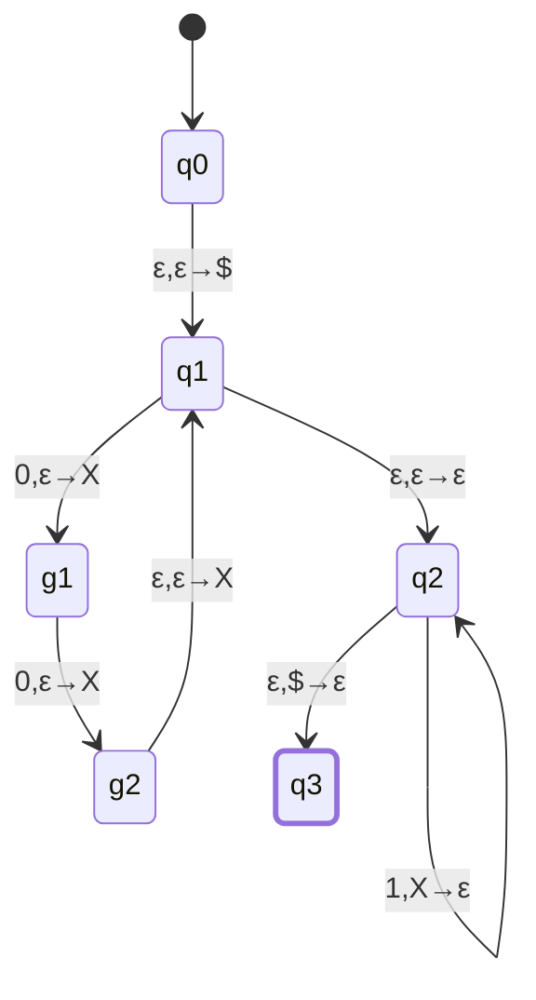
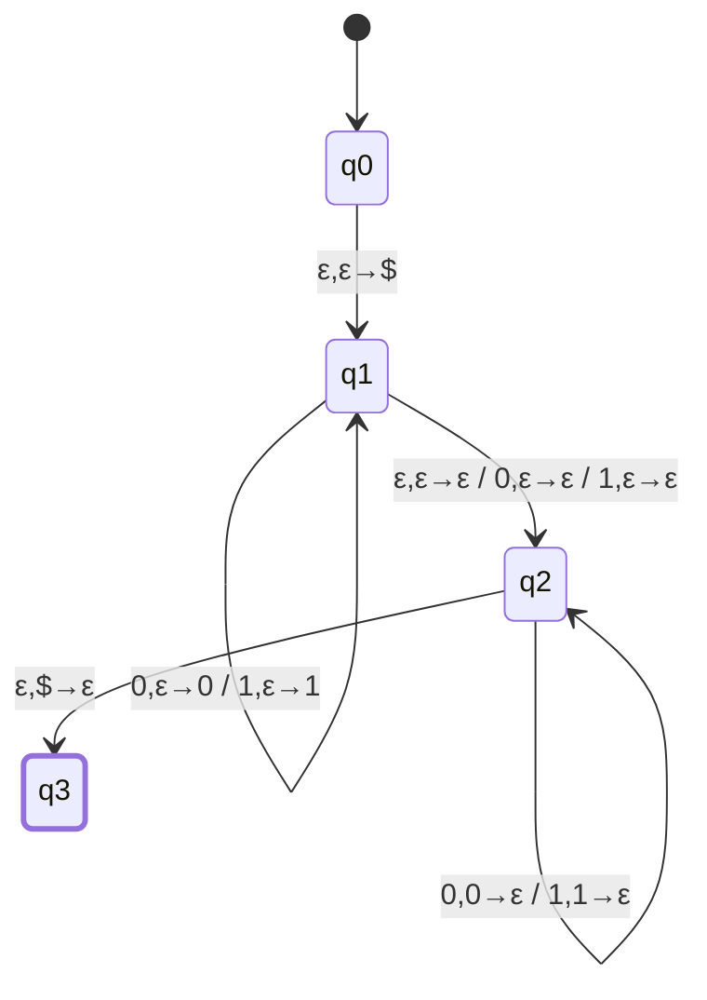
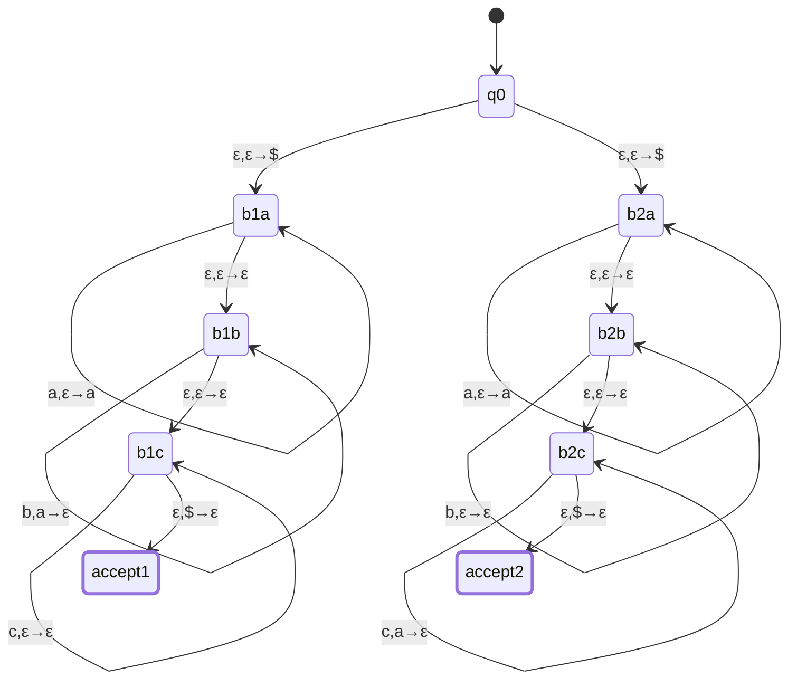
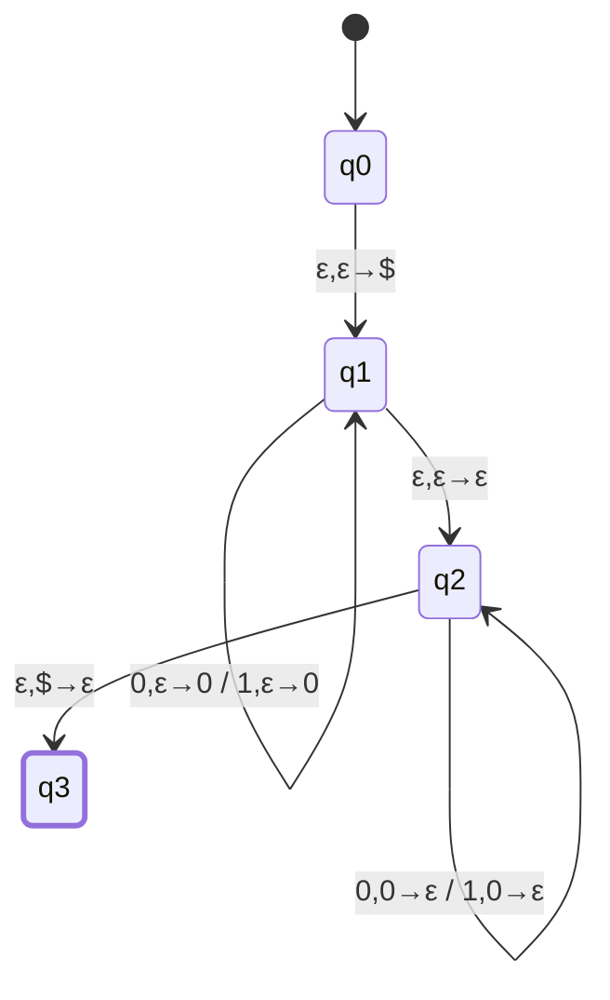
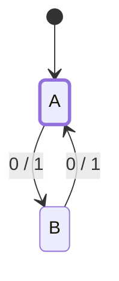
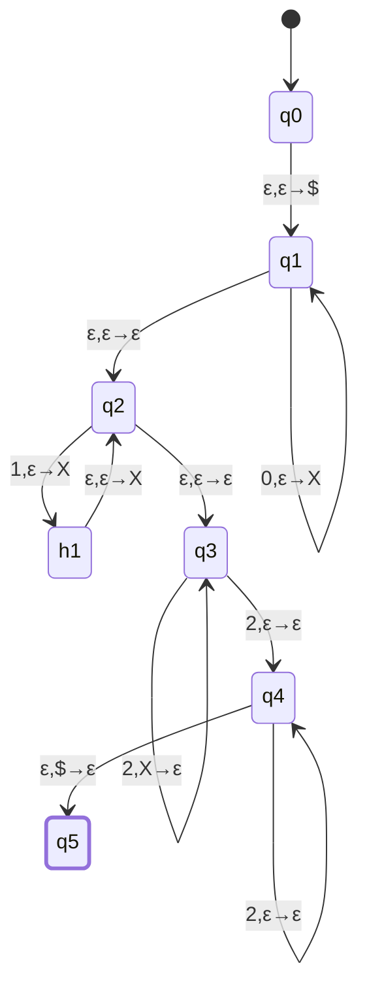

# CSE331 — Lecture 16: More PDA Constructions, then Turing Machines

Continues Topic 13 (PDA) with four more constructions — a non-1:1 exponent ratio ($0^{2n}1^{3n}$), a palindrome PDA, a nondeterministic-branch PDA for a disjunction of constraints ($a^ib^jc^k$, $i=j$ or $i=k$), and a cautionary example (a purely regular language built with a PDA, contrasted with the simpler NFA) — then opens Topic 17 (Turing Machines) with the informal definition and configuration notation.

Uses the same transition notation as [Lecture 15](CSE331_lecture_15_2026-08-17.md): $a, b \to c$ means read input $a$ (or $\varepsilon$), pop $b$ (or $\varepsilon$), push $c$ (or $\varepsilon$).

## $\{0^{2n}1^{3n} : n \geq 0\}$

> [!success] Faculty-confirmed (2026-08-19/20)
> Asked TNF directly whether a single transition may push two copies at once (e.g. $0,\varepsilon\to XX$). Her worked example instead used **two separate states** to get two pushes: one ordinary transition on input ($0,\varepsilon\to X$) followed by a second, input-free transition that pushes again ($\varepsilon,\varepsilon\to X$) before rejoining the main cycle. That two-state-per-extra-push technique is confirmed valid. This also resolves the earlier reading-ambiguity flag on this diagram: "use 3 states for 0" is exactly this pattern extended one step further — two states that each consume one input $0$ and push one $X$ ($q_1\to g_1\to g_2$), plus a third, input-free state that pushes the extra $X$ ($g_2\to q_1$) to reach the $3$-pushes-per-$2$-inputs ratio the language needs. The single-edge "push $XX$ at once" version below the previous revision of this note was an unconfirmed shortcut and has been replaced with the confirmed construction.
>
> **Follow-up answered (Discord, TNF, 2026-08-19 3:36 PM):** a single transition pushing multiple symbols at once (e.g. $0,\varepsilon\to XX$) **is allowed**. The constraint is one-directional — popping must still be done one symbol at a time; multi-symbol push has no such restriction. TNF's exact wording: "You can push multiple symbols in the stack. But popping symbols is done one at a time. For consistency, only one symbol push and pop was shown." So the two-state-per-push construction above is a valid *style choice* matching the board example, not the only valid technique — a construction using $0,\varepsilon\to XX$ directly would be equally correct, provided any corresponding pop is still done one symbol per transition.

Three states cycle for every group: $q_1\to g_1$ and $g_1\to g_2$ each consume one input $0$ and push one $X$; $g_2\to q_1$ is input-free and pushes a third $X$, closing the loop. Two inputs in, three pushes out — after $n$ groups the stack holds $3n$ symbols, matched one-for-one against $3n$ input $1$s by the plain self-loop on $q_2$.

> [!info] Margin note (verbatim intent)
> "We pushed the same number of symbols [as] the number of $1$s we need" — i.e. the push count is deliberately set to equal the required pop count ($3n$), which is the general principle this construction (and the two-per-input-symbol gadget) is demonstrating.

## Palindrome (even or odd length)

Uses the property that a stack can hold **multiple distinct symbols**, not just a counter:

$q_1$ pushes whichever symbol is read, building the first half onto the stack. $q_1\to q_2$ is a nondeterministic guess of the midpoint, with three edges: the plain $\varepsilon,\varepsilon\to\varepsilon$ guess for even-length strings, plus $0,\varepsilon\to\varepsilon$ / $1,\varepsilon\to\varepsilon$ for odd-length strings, each consuming one unmatched middle symbol with no stack effect. $q_2$ pops and compares against the second half — the input symbol must match the top of the stack.

## $\{a^ib^jc^k : i=j \text{ or } i=k\}$ — nondeterministic branch

The machine pushes $\$$, then nondeterministically branches into two parallel constructions — one enforcing $i=j$ (with $c$ unconstrained), the other enforcing $i=k$ (with $b$ unconstrained) — and accepts if either branch empties the stack. Both branches push $a$ the same way; only what happens to $b$ and $c$ afterward differs:

**Branch 1 ($i=j$, $c$ free):** self-loop $a,\varepsilon\to a$ pushes one symbol per $a$; after the $a$-block, self-loop $b,a\to\varepsilon$ pops one symbol per $b$, enforcing $i=j$; self-loop $c,\varepsilon\to\varepsilon$ then lets every $c$ pass through with no stack effect.

**Branch 2 ($i=k$, $b$ free):** the same $a,\varepsilon\to a$ push as Branch 1 builds up $i$ on the stack; self-loop $b,\varepsilon\to\varepsilon$ lets every $b$ pass through with no stack effect (letting $j$ be unconstrained); self-loop $c,a\to\varepsilon$ then pops one symbol per $c$, matching $k$ against the $a$'s pushed earlier — enforcing $i=k$.

> [!info] Margin note (verbatim intent)
> "You can also branch out after the $a, \varepsilon \to a$ step" — both branches push $a$ identically, so the nondeterministic branch point can be delayed to just after the shared $a$-block instead of sitting at the very start (i.e. $q_0$ could push $\$$, run one shared $a,\varepsilon\to a$ self-loop, and only then split into the $b$/$c$-handling halves above — equivalent to, but more compact than, duplicating the $a$-block in both branches).

## "Length is a multiple of 2" — a regular language via PDA (cautionary example)

$q_1$ pushes a marker regardless of which symbol is read — the stack is only being used to count, not to remember content.

> [!note] Caption (verbatim)
> "It works, but not the best approach."

A second, much smaller diagram directly beneath it makes the point explicit — a plain 2-state NFA ping-pong already decides "even length" with no stack use at all:

> [!info] Caption (verbatim)
> "For RE [regular languages], it's better to use a regular NFA and just push nothing but $\varepsilon$." — i.e. a PDA can always simulate an NFA (push/pop nothing), but for a genuinely regular language the plain NFA is the right tool; reach for the stack only when the language actually needs unbounded memory.

## $\{0^i1^j2^k : k > i+2j\}$

$q_1$ pushes one $X$ per $0$ (contributing $i$ symbols). $q_2$/$h_1$ push **two** $X$s per input $1$ — one on the input edge ($q_2\to h_1$), one on the input-free edge back ($h_1\to q_2$) — using the same two-state-per-extra-push technique confirmed by TNF (see the $0^{2n}1^{3n}$ construction above), contributing $2j$ symbols so the stack now holds $i+2j$ copies of $X$. $q_3$ pops one $X$ per input $2$, matching $k$ against $i+2j$. The mandatory $q_3\to q_4$ edge consumes at least one further $2$ with no stack effect, guaranteeing $k$ is *strictly* greater than $i+2j$, before $q_4$'s self-loop absorbs any remaining extra $2$s.

> [!info] Margin note (verbatim)
> "If $k = i+2j$, then [we need] at least 1 more $k$." And: "if we wanted $k \geq i+2j$, we would just change this part to $\varepsilon,\varepsilon\to\varepsilon$" — pointing at the $q_3\to q_4$ step. Making that step optional (rather than a required single firing before the free-absorption self-loop) is exactly what turns the strict inequality into $\geq$.

---

## Turing Machines (Topic 17) — informal definition and configuration

- A TM can decide/detect regular languages, context-free languages, **and** non-context-free languages — strictly more powerful than a PDA.
- Structurally: a DFA plus an infinite tape. The tape is **semi-infinite** — it has a start, but no end.
- The semi-infinite tape behaves like an infinite array: the machine reads/writes a cell and can move the head left or right.

**Configuration notation** — a string like $011\,q_7\,01$ packs the entire instantaneous state of the machine into one line: the state name sits inline between the tape contents to its left and to its right, and the head is positioned on the first symbol to the right of the state marker.

Worked example, configuration $011\,q_7\,01$:
- Current state: $q_7$
- Tape content: $01101$ (concatenating the two halves around the state marker)
- Head position: the second $0$ in the tape content (the $0$ immediately following the state marker — i.e. position 4 of $01101$, which is the second occurrence of $0$ reading left to right)

## Anki Cards

START
Basic
What can a Turing Machine detect that a PDA cannot, and what is the structural difference between them?
Back: A TM detects regular languages, context-free languages, and non-context-free languages (strictly more powerful than a PDA, which only handles CFLs). Structurally, a TM is a DFA plus an infinite (semi-infinite — has a start, no end) tape, which behaves like an infinite array.
END

START
Basic
Given the TM configuration $011\,q_7\,01$, identify the current state, the tape content, and the head position.
Back: State $q_7$; tape content $01101$ (concatenation of the two halves); head is on the second $0$ in the tape content — the symbol immediately to the right of the state marker.
END

START
Basic
Why is it "not the best approach" to decide "length is a multiple of 2" with a PDA, per Lecture 16?
Back: The construction works (push a marker per symbol, then pop two per symbol on the way back) but the language is regular — a plain 2-state NFA ping-pong with no stack use at all already decides it. Reserve the stack for languages that actually need unbounded memory.
END

START
Basic
In the PDA for $\{0^i1^j2^k : k > i+2j\}$, what single change converts it to accept $k \geq i+2j$ instead?
Back: Change the mandatory "consume at least one extra 2 with no stack effect" step (required once, before the free-absorption self-loop) into an optional $\varepsilon,\varepsilon\to\varepsilon$ transition — removing the requirement that at least one unmatched $2$ exists turns the strict inequality into $\geq$.
END
