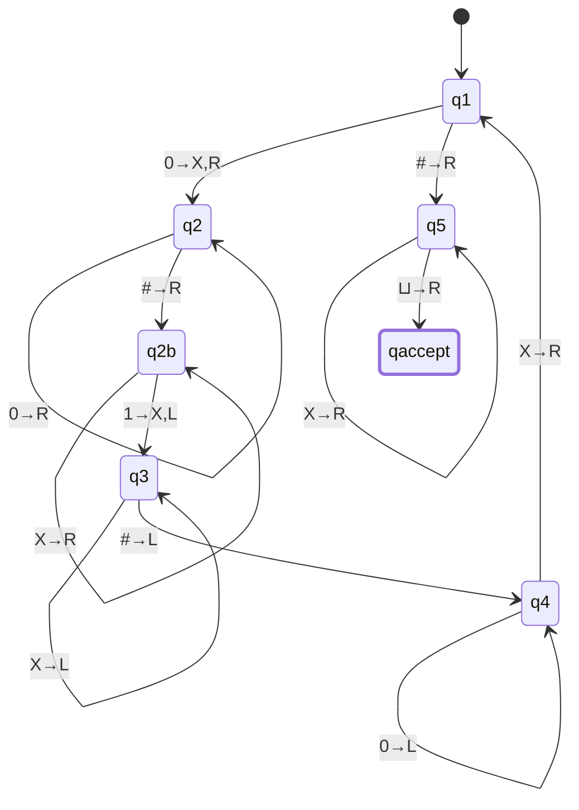
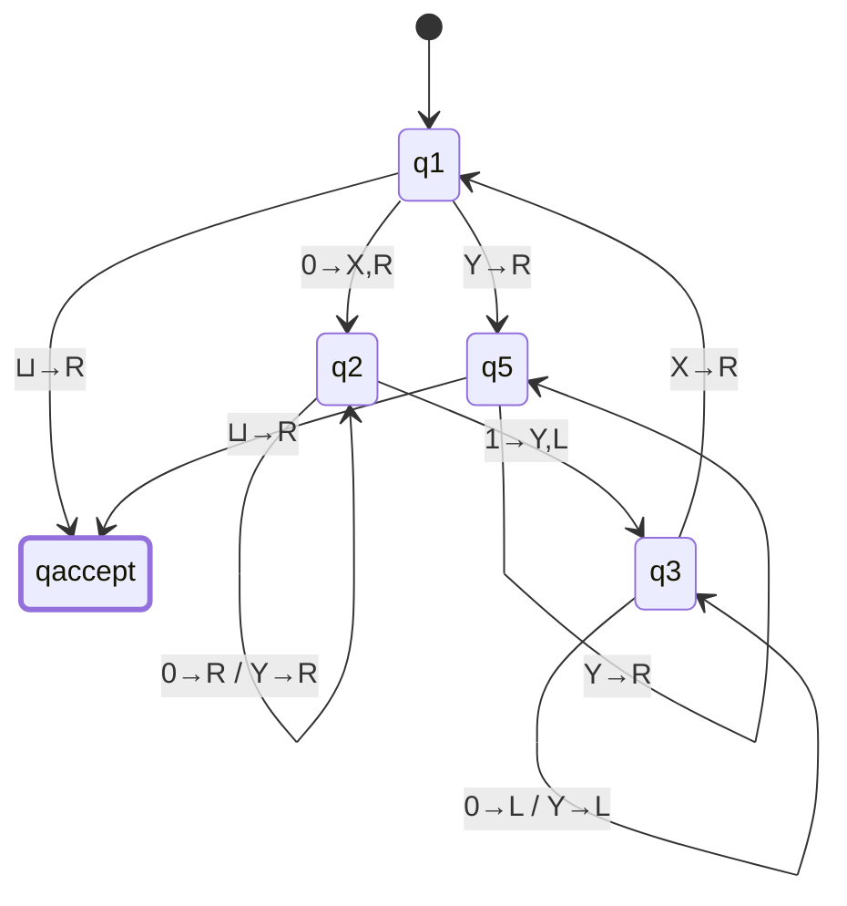
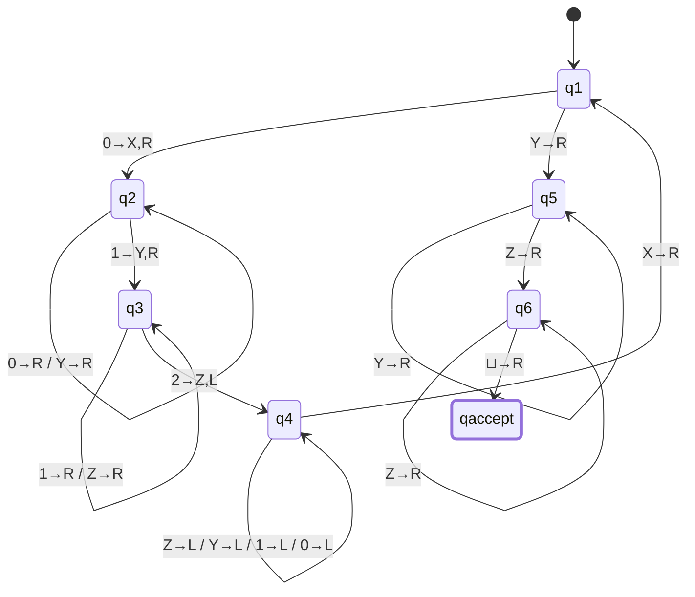
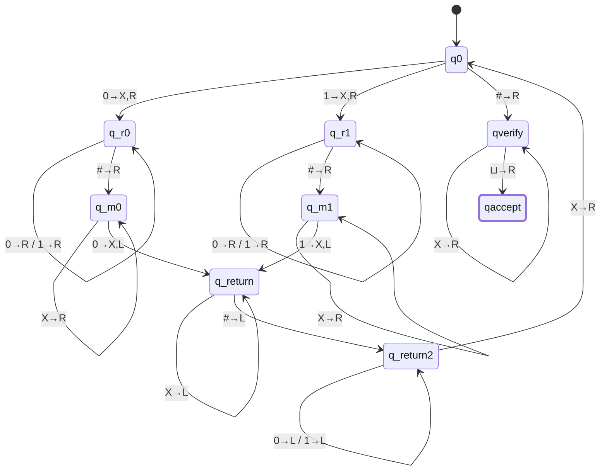

# CSE331 — Lecture 17: Turing Machine Constructions

Opens exactly where [Lecture 16](CSE331_lecture_16_2026-08-19.md) left off (same TM definition and configuration-notation recap), then works through a sequence of TM constructions of increasing complexity: a boundary-marked unary match ($0^n\#1^n$), the general symbol-replacement/crossing-off technique, the classic two-symbol match ($0^n1^n$), a three-symbol match ($0^i1^j2^k,\ i=j=k$), and two ungraded HW languages (palindrome, equal count of 0s/1s). Ends on an incomplete $w\#w$ construction, which the note explicitly asked to have completed — done below, clearly marked as not part of the original scan.

## Recap (same as Lecture 16)

- A TM can decide/detect regular languages, context-free languages, **and** non-context-free languages.
- Structurally: a DFA plus a semi-infinite tape (has a start, no end), which behaves like an infinite array.
- Configuration notation: a string like $011\,q_7\,01$ packs state + tape content + head position into one line — see Lecture 16 for the full worked example.

## $\{0^n\#1^n\}$ — boundary-marked unary match

Worked example, $n=3$: tape = $000\#111\,\sqcup\,\sqcup$ ($\sqcup$ = blank symbol), head starts on the leftmost $0$ (labeled "starting symbol").

> [!info] Margin note (verbatim intent)
> "We will assume the tape is storing the whole string, we don't have to show it [separately]" — i.e. treat the tape content itself as the input; no separate step needed to first "load" the string onto the tape.

## General technique: replace matched symbols

Core idea introduced here, reused in every construction below:

- When two symbols are matched (a $0$ against a $1$, or a symbol against its counterpart), **overwrite both with a marker** (e.g. $X$) rather than just reading past them.
- Once all symbols are matched and turned into markers, do a final pass checking whether any unmarked $0$/$1$ is left — if none remain, accept.
- "In a Turing Machine, we don't draw all states like a regular DFA" — TM diagrams here show only the states relevant to the construction, not an exhaustive state set.

$L = \{0^n\#1^n : n \geq 0\}$. Mark matched pairs with $X$ (for the $0$) and $X$ (for the $1$) as they're paired off; after each pairing, walk back left only as far as this round's own newly-marked $0$, then step past it — not all the way to the tape's absolute start:

- $q_1$: find the next unmarked $0$; mark $X$, move right to hunt for its matching $1$ ($q_2$). On reaching $\#$ with no unmarked $0$ left (all $0$s matched, or $n=0$), move to $q_5$ to verify the $1$-side is equally exhausted. ($q_1$ never needs to read an $X$ directly — the return trip from $q_4$ already steps past it before handing control back.)
- $q_2 \to q_{2b}$: skip the rest of the $0$-block, cross $\#$, then skip already-matched $1$s until the first unmarked $1$.
- $q_{2b} \to q_3$: mark that $1$ as $X$, move left.
- $q_3$: walk back left over already-matched $1$s (now $X$) until crossing $\#$ into $q_4$ — never an unmarked $1$, since $q_{2b}$ always marks the leftmost unmarked one first.
- $q_4$: walk back left over this round's remaining unmarked $0$s until hitting the $X$ marking this round's own $0$ — step right past it, landing back in $q_1$ already on the next cell that needs processing.
- $q_5$: skip remaining $X$s; a $\sqcup$ with nothing unmarked in between → **accept**. (An unmarked $1$ reached instead — no transition defined — means more $1$s than $0$s and the machine rejects by getting stuck, the standard TM convention.)

Trace check, $n=2$ ($00\#11$): round 1 marks the first $0$ and first $1$ → $X0\#X1$; round 2 marks the second $0$ and second $1$ → $XX\#XX$; $q_1$ then finds no unmarked $0$, moves to $q_5$, skips the four $X$s, hits $\sqcup$ → accept. For $n=1,m=2$ ($0\#11$): round 1 marks the single $0$ and one $1$ → $X\#X1$; $q_1$ finds no unmarked $0$, $q_5$ skips the matched $X$ but then meets the unmarked leftover $1$ → no transition, reject. Correct on both sides.

## $\{0^n1^n : n \geq 0\}$ — two-symbol match (X/Y)

Classic construction, marking $0$s with $X$ and $1$s with $Y$:

- $q_1$: on blank, accept immediately (handles $n=0$); on $0$, mark $X$ and move right to $q_2$ (start hunting for the matching $1$); on $Y$ (all $0$s already matched), move right to $q_5$ to verify the tail.
- $q_2$: skip remaining unmarked $0$s and already-matched $Y$s moving right; on the first unmarked $1$, mark $Y$ and move left to $q_3$.
- $q_3$: skip back left over $0$s and $Y$s until hitting the $X$ boundary, step right onto the next unmarked $0$, back to $q_1$.
- $q_5$: skip remaining $Y$s; on blank, accept.

This matches the scan's labels (`0,X→R`, `Y→R,0→R`, `1,Y→L`, `Y→L,0→L`, `Y→R`, `X→R`, `Y→R`, `⊔→R`).

## $\{0^i1^j2^k : i=j=k, i>0\}$ — three-symbol match (X/Y/Z)

Same crossing-off technique extended to three symbol classes: $0\to X$, $1\to Y$, $2\to Z$. Tape example: $001122\,\sqcup\,\sqcup$. Relies on the blocks being adjacent and in order (no separator needed, unlike $0^n\#1^n$ above) — the boundary between blocks is detected by "no more of the previous symbol remains."

> [!warning] Scope assumption: $i,j,k > 0$ (2026-09-10)
> Neither the scan nor the faculty's class notes state the lower bound explicitly (unlike $0^n1^n, n\geq 0$ and $0^n\#1^n$ above, both stated with $\geq 0$). Since it isn't stated, this construction is assumed to only be claiming $i,j,k > 0$, not $\geq 0$. This matters mechanically: $q_1$ has no transition for reading blank ($\sqcup$), unlike the two-symbol construction above (which has an explicit `q1 --> qaccept : ⊔→R` shortcut for $n=0$) — neither image shows an equivalent shortcut here. Under the $>0$ reading that's not a gap, just out of scope; if the intended language is actually $i,j,k\geq 0$, this diagram would need that shortcut added to correctly accept the empty string. Flagged rather than silently fixed, since adding it would mean guessing at something neither source actually shows.

- $q_1$: find next unmarked $0$, mark $X$, move right toward the $1$-block ($q_2$). Once no unmarked $0$ remains (only $Y$s left), move to $q_5$ to verify the $1$- and $2$-blocks are equally exhausted. ($q_1$ never needs to read an $X$ directly — the return trip from $q_4$ already steps past it before handing back control.)
- $q_2 \to q_3$: skip the rest of the $0$-block, find the first unmarked $1$, mark $Y$, keep moving right (toward the $2$-block, unlike the two-symbol case, since one round now needs to touch all three blocks).
- $q_3 \to q_4$: skip the rest of the $1$-block, find the first unmarked $2$, mark $Z$, then turn left.
- $q_4$: walk back left over this round's already-matched $1$s and $2$s, then this round's remaining unmarked $0$s, until hitting the $X$ marking this round's own $0$ — step right past it, re-enter $q_1$ already on the next cell to process.
- $q_5$: skip matched $Y$s; if an unmarked $1$ is hit instead, no transition — reject ($j > i$). On reaching an (unmarked) $Z$-block start, move to $q_6$.
- $q_6$: skip matched $Z$s; a $\sqcup$ with nothing left unmarked → **accept**; an unmarked $2$ instead — reject ($k > j$).

If $i > j$ or $i > k$, $q_2$ or $q_3$ eventually finds no unmarked $1$/$2$ to mark and has no transition defined — reject, matching the standard TM convention used throughout this note.

## Flagged as ungraded HW (not solved here)

- Odd palindrome, even palindrome, and palindrome (general) — **HW, ungraded**. **Given by TNF, in class** (Lecture 16): design a Turing Machine that decides the language of palindromes — the TM counterpart to the PDA palindrome construction ([Lecture 16](CSE331_lecture_16_2026-08-19.md)). **Hint (TNF):** once the head has read the leftmost unchecked symbol and stepped across the tape to confirm the rightmost unchecked symbol is the same character, don't leave that right-hand symbol in place — overwrite it with blank before turning back. Each completed match should erase its right-hand half immediately, so the next left-to-right pass always lands on the new outer boundary of what's left to check, rather than needing to somehow remember how far in the previous pass got. Not yet attempted.
- Language where the number of $0$s equals the number of $1$s — **HW, ungraded**.

## $\{w\#w : w \in \{0,1\}^*\}$

> [!note] Completed by Claude, corrected 2026-09-10
> The scan flagged this construction as incomplete with an explicit note ("This one is incomplete. Claude, complete it"). The diagram and algorithm below are **not from the original scan** — they're a standard construction in the same crossing-off style as the two constructions above, added to finish the note per that request. The first version of this completion carried the same "walk all the way back to the tape start" bug found and fixed elsewhere in this file — corrected below to the same stop-at-the-boundary-marker technique.

Tape example: $w = 011 \Rightarrow 011\#011\,\sqcup\,\sqcup\ldots$

Algorithm:

1. $q_0$: on the leftmost unmarked bit (0 or 1), mark it $X$, remember its value (branch to $q_{r0}$ or $q_{r1}$), move right. On reaching the $\#$ with no unmarked bit left before it, move right to $q_{verify}$ (left half fully matched — confirm the right half is too). ($q_0$ never needs to read an $X$ directly — the return trip from $q_{return2}$ already steps past it before handing back control.)
2. $q_{r0}/q_{r1}$: skip right across the rest of the left half's remaining unmarked bits, cross the $\#$, then skip right across already-matched $X$s in the right half, until the first unmarked bit. (Never needs to skip an $X$ on the left-half side — $q_0$ always marks the leftmost unmarked bit, so nothing unmarked-then-marked can sit ahead of it within the still-unprocessed left half.)
3. $q_{m0}/q_{m1}$: skip already-matched $X$s in the right half; on the matching bit ($1$ in $q_{m0}$'s case, since $q_{m0}$ is hunting for a $0$ to have already been skipped — see transition table below), mark $X$ and move left ($q_{return}$). On the *mismatching* bit, or on $\#$/$\sqcup$ reached before any unmarked bit is found (right half shorter than left) — no transition defined, **reject** by the standard TM convention (no move = stuck = reject).
4. $q_{return}$: walk back left over already-matched $X$s remaining in the right half (never an unmarked bit there, by the same leftmost-unmarked invariant), until crossing $\#$ into $q_{return2}$.
5. $q_{return2}$: walk back left over this round's remaining unmarked left-half bits, until hitting the $X$ marking this round's own left-half mark — step right past it, re-enter $q_0$ already positioned on the next unmarked bit.
6. $q_{verify}$: once the left half is exhausted, skip remaining $X$s in the right half; a $\sqcup$ with nothing unmarked in between means the right half was exactly as long as the left half → **accept**. An unmarked bit found instead means the right half was longer → reject.

Full transition table for the matching states (the mermaid diagram above shows only the match-found edges; the reject edges are intentionally absent — an undefined transition *is* the reject):

| State | Reads | Action |
|---|---|---|
| $q_{m0}$ | $X$ | move R, stay $q_{m0}$ (skip already-matched) |
| $q_{m0}$ | $0$ | write $X$, move L, go $q_{return}$ (match: remembered bit was $0$) |
| $q_{m0}$ | $1$, $\#$, $\sqcup$ | *(no transition — reject)* |
| $q_{m1}$ | $X$ | move R, stay $q_{m1}$ |
| $q_{m1}$ | $1$ | write $X$, move L, go $q_{return}$ (match: remembered bit was $1$) |
| $q_{m1}$ | $0$, $\#$, $\sqcup$ | *(no transition — reject)* |

## Pumping Lemma (Review) — from faculty's own class notes

> [!info] Reconstructed from theory, not read off the scan
> `Turing Machine Class notes.pdf` page 1 is too faint to transcribe by eye. But every fragment that *is* legible — `p≥4`, `0^p1^p`, the crossed-out `y→01…`/`y→1…` attempts, `a^p b^{p+p!}`, `pf → a^p b^p!`, "proof by complement" — pins down a specific, standard, checkable proof. Worked forward from theory below and verified against those fragments; treat this as a reconstruction, not a transcription, but a high-confidence one (the numbers below are consistent with every legible fragment). Source file still held, not deleted, since this is inference rather than a direct read.

### $\{0^n1^n : n \geq 0\}$ is not regular

Matches the `p≥4`, `0^p1^p` fragment — the standard proof, and the one your crossed-out `y→01…`/`y→1…` notes are the *ruled-out* cases of, not valid alternatives:

1. Suppose $L=\{0^n1^n\}$ is regular, with pumping length $p$.
2. Take $w = 0^p1^p \in L$. By the pumping lemma, $w = xyz$ with $|xy| \le p$, $y \neq \varepsilon$.
3. Because $|xy|\le p$, $xy$ sits entirely inside the first $p$ characters — i.e. the $0$-block. So $y$ **cannot** contain a $1$ or the boundary — the candidate cases $y \to 01\ldots$ and $y \to 1\ldots$ are impossible given the constraint, which is exactly why they're crossed out. The only possible shape is $y = 0^k$ for some $1 \le k \le p$.
4. Pump down ($i=0$): $xy^0z = 0^{p-k}1^p$. Since $k \ge 1$, $p-k < p$, so this string has fewer $0$s than $1$s — **not** in $L$.
5. This contradicts the pumping lemma (which guarantees $xy^iz \in L$ for all $i \ge 0$), so $L$ is not regular.

### Second example, same technique (witness $0^p1^{2p+1}$)

The visible witness string is $0^p1^{2p+1}$, which strongly suggests reviewing a language with a *fixed* (not just unequal) block-length relationship — e.g. $\{0^n1^m : m = 2n+1\}$. The argument is identical in shape to the one above and is included for completeness, though — unlike the two proofs on either side of it — the exact target language isn't independently confirmable from the fragments, so treat the language name itself as inferred, not certain:

1. $w = 0^p1^{2p+1}$ satisfies $m=2p+1=2n+1$. As before, $|xy|\le p$ forces $y=0^k$, $1\le k\le p$.
2. Pumping down: $n' = p-k$, but $m=2p+1$ is unchanged. Need $m = 2n'+1 = 2p-2k+1$ for membership — false whenever $k\ge1$. Contradiction, same shape as the $0^n1^n$ proof: any language requiring an exact fixed relationship between the block lengths breaks under this style of "pump inside the first block" argument.

### $\{a^nb^m : n \neq m\}$ — the factorial trick, then the complement shortcut

This is the part your own note (CamScanner) didn't have. Two methods appear, matching `hint → a^p b^{p+p!}`, `pf → a^p b^p!`, and "proof by complement":

**Method 1 — direct pumping with a factorial-length witness.** Naive choices of $w$ often fail here, because pumping $a^nb^m$ with $n\neq m$ doesn't always break the "$\neq$" — this is exactly why the witness is deliberately chosen as $a^p\,b^{\,p+p!}$ rather than something simpler:

1. $w = a^p b^{p+p!}$: $n=p$, $m=p+p!$, and $n\neq m$ since $p!\ge1$ — so $w\in L$.
2. $|xy|\le p$ forces $y = a^k$ for some $1\le k\le p$ (same "$xy$ sits inside the first block" reasoning as above).
3. Pump $i$ times: new $n' = p+(i-1)k$. Choose $i = \dfrac{p!}{k}+1$ — an integer, because $k\le p$ so $k$ divides $p!$. Then $n' = p + p! = m$.
4. The pumped string $a^{p+p!}b^{p+p!}$ has $n'=m$ — **not** in $L$ (which needs $n\neq m$). Contradicts the pumping lemma. This is the `pf → a^p b^p!` fragment: the pumped-to string lands exactly on $a^{p+p!}b^{p+p!}$, i.e. the "$p!$" is what guarantees an integer pump count exists for *every* possible $k\in[1,p]$ — that's the whole trick.

**Method 2 — proof by complement (the "lecture video" pointer, and the cleaner route).** Direct pumping works but is fiddly (hence the factorial trick above); the complement argument sidesteps it:

1. Suppose $L=\{a^nb^m : n\neq m\}$ is regular. Regular languages are closed under complement, so $\overline{L} = \{a^nb^m : n=m\} \cup \{\text{strings not of the form } a^*b^*\}$ is regular too.
2. $a^*b^*$ is regular (trivially — a two-state DFA). Regular languages are closed under intersection, so $\overline{L}\cap a^*b^*$ is regular.
3. $\overline{L}\cap a^*b^* = \{a^nb^n : n\ge 0\}$ — exactly the classic non-regular language already proved in [Lecture 11](CSE331_lecture_11_2026-07-21.md).
4. Contradiction — so $L$ is not regular either. No pumping-length case analysis needed at all, which is presumably why it's flagged as the preferred technique ("lecture video → proof by complement").

> [!tip] If the original scan is still around
> Since this section is now a reconstruction rather than a transcription, a quick glance at the source scan to confirm the second example's language name (the one part flagged as inferred above) would fully close this out — everything else here is independently verified against the visible numeric fragments, not dependent on reading the handwriting further.

## Anki Cards

START
Basic
What extra power does the "replace matched symbols with a marker" technique give a TM, and why don't TM diagrams show every state the way DFA diagrams do?
Back: Marking (e.g. 0→X, 1→Y) lets the TM remember which symbols have already been matched across multiple passes over the tape — something a DFA's fixed finite memory can't do. TM diagrams by convention only show the states relevant to the construction being explained, not an exhaustive state set.
END

START
Basic
In the classic {0^n1^n} Turing Machine, what do the states q1, q2, q3, and q5 each do?
Back: q1 marks the next unmarked 0 as X and heads right (or accepts on blank, or moves to q5 once no 0s remain). q2 skips right past 0s/Ys to the next unmarked 1, marks it Y. q3 skips back left over 0s/Ys to the X boundary, then steps right to repeat. q5 skips remaining Ys and accepts on blank.
END

START
Basic
For {w#w : w in {0,1}*}, what's the core loop of the crossing-off construction?
Back: Mark the leftmost unmarked bit on the left of # as X (remembering its value), scan right past # to the first unmarked bit on the right side, mark it X if it matches (else reject), then walk back left only as far as this round's own left-half mark and step past it (not all the way to the tape start) and repeat. Accept once the left half is exhausted and the right half has no unmarked bit left either.
END

START
Basic
In the standard pumping-lemma proof that {0^n1^n} is not regular, why must y consist only of 0s — and what does pumping down then break?
Back: The constraint |xy| ≤ p forces xy to sit entirely inside the first p characters of w=0^p1^p, which is the 0-block — so y can't contain a 1 or the boundary; y = 0^k for some k≥1. Pumping down (i=0) gives 0^(p-k)1^p, which has fewer 0s than 1s — not in the language, contradicting the pumping lemma.
END

START
Basic
Why is a^p b^(p+p!) the witness string used to directly pump {a^n b^m : n≠m}, instead of a simpler string?
Back: y must be a^k for some 1≤k≤p (same |xy|≤p argument). Pumping i = p!/k + 1 times — an integer because k≤p divides p! — adds exactly p! more a's, landing on a^(p+p!) b^(p+p!), where n=m. That string is excluded from the language (which needs n≠m), giving the contradiction. The p! is chosen specifically so an integer pump count exists no matter which k∈[1,p] gets picked.
END

START
Basic
What's the "proof by complement" shortcut for showing {a^n b^m : n≠m} is not regular, and why is it cleaner than direct pumping?
Back: If L were regular, its complement would be too (closure under complement), and intersecting that complement with the regular language a*b* gives exactly {a^n b^n} — already known non-regular. Contradiction. No case analysis on y needed at all, unlike the direct factorial-trick pumping proof.
END
