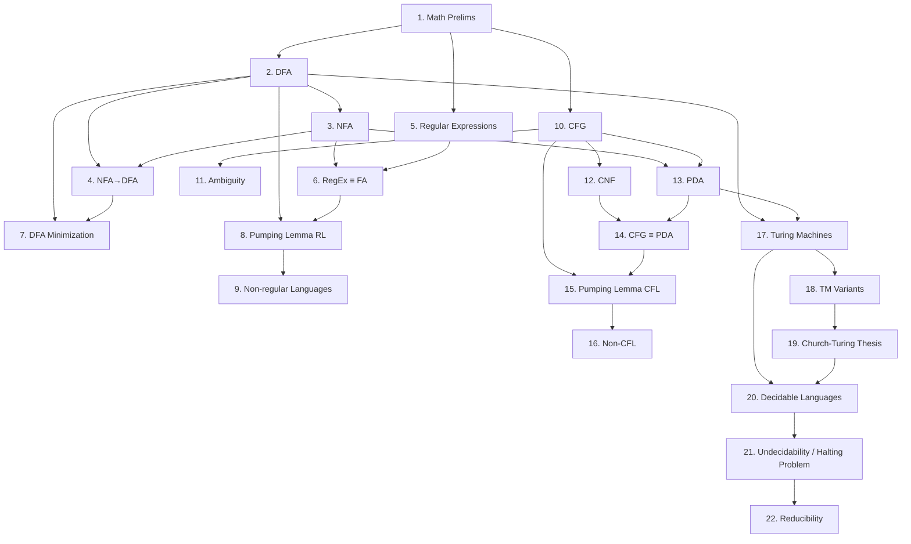

# CSE331 — Topic Map: Theory of Computation

Theory of Computation asks three questions: What problems can computers solve at all? What problems can they solve efficiently? What does it mean to "compute" something? This course answers the first question rigorously, using mathematical models of machines and formal languages. The textbook is Sipser — follow it closely.

## Topic Table

| # | Topic | Sipser | Category | Importance | Depends On |
|---|-------|--------|----------|------------|------------|
| 1 | Mathematical Preliminaries: sets, functions, relations, graphs, strings, proofs | Ch 0 | Foundations | Core | CSE230 |
| 2 | Deterministic Finite Automata (DFA) — definition, computation, language | Ch 1.1 | Regular Languages | Core | 1 |
| 3 | Nondeterministic Finite Automata (NFA) — definition, computation | Ch 1.2 | Regular Languages | Core | 2 |
| 4 | NFA to DFA Conversion — subset construction | Ch 1.2 | Regular Languages | Core | 2, 3 |
| 5 | Regular Expressions — syntax, semantics | Ch 1.3 | Regular Languages | Core | 1 |
| 6 | Equivalence of Regular Expressions and Finite Automata | Ch 1.3 | Regular Languages | Core | 3, 5 |
| 7 | DFA Minimization — distinguishable states, table-filling algorithm | Ch 1 | Regular Languages | Core | 2, 4 |
| 8 | Pumping Lemma for Regular Languages — statement and proofs | Ch 1.4 | Regular Languages | Core | 2, 6 |
| 9 | Non-regular Languages — pumping lemma proof technique | Ch 1.4 | Regular Languages | Core | 8 |
| 10 | Context-Free Grammars (CFG) — definition, derivations, parse trees | Ch 2.1 | Context-Free Languages | Core | 1 |
| 11 | Ambiguity in CFGs — ambiguous grammars, inherent ambiguity | Ch 2.1 | Context-Free Languages | Important | 10 |
| 12 | Chomsky Normal Form (CNF) — conversion procedure | Ch 2.1 | Context-Free Languages | Important | 10 |
| 13 | Pushdown Automata (PDA) — definition, computation | Ch 2.2 | Context-Free Languages | Core | 3, 10 |
| 14 | Equivalence of CFGs and PDAs | Ch 2.2 | Context-Free Languages | Core | 12, 13 |
| 15 | Pumping Lemma for Context-Free Languages — statement and proofs | Ch 2.3 | Context-Free Languages | Core | 10, 14 |
| 16 | Non-context-free Languages — pumping lemma proof technique | Ch 2.3 | Context-Free Languages | Core | 15 |
| 17 | Turing Machines — 7-tuple definition, computation, configuration | Ch 3.1 | Computability | Core | 2, 13 |
| 18 | TM Variants — multi-tape TM, nondeterministic TM, equivalence | Ch 3.2 | Computability | Core | 17 |
| 19 | Church-Turing Thesis — informal algorithms and TM equivalence | Ch 3.3 | Computability | Core | 18 |
| 20 | Decidable Languages — A_DFA, A_CFG, E_DFA, EQ_DFA decidability | Ch 4.1 | Decidability | Core | 17, 19 |
| 21 | Undecidability — diagonalization, A_TM undecidable (Halting Problem) | Ch 4.2 | Decidability | Core | 20 |
| 22 | Reducibility and Undecidable Problems — mapping reducibility, Rice's Theorem | Ch 5.1–5.3 | Reducibility | Core | 21 |

## Dependency Graph

## Recommended Study Order

1. Mathematical Preliminaries
2. DFA
3. NFA
4. NFA to DFA Conversion
5. Regular Expressions
6. Equivalence of RegEx and FA
7. DFA Minimization
8. Pumping Lemma for Regular Languages
9. Non-regular Languages
10. Context-Free Grammars
11. Ambiguity in CFGs
12. Chomsky Normal Form
13. Pushdown Automata
14. Equivalence of CFGs and PDAs
15. Pumping Lemma for Context-Free Languages
16. Non-context-free Languages
17. Turing Machines
18. TM Variants
19. Church-Turing Thesis
20. Decidable Languages
21. Undecidability and the Halting Problem
22. Reducibility and Rice's Theorem
