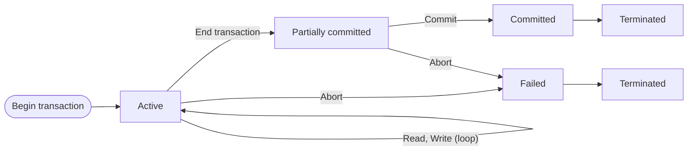

# Transactions & ACID Properties
**Course:** CSE370 — Database Systems
**Date:** 2026-09-06

**Scope note:** Covers Topic 23 (Transaction Management) from `cse370_topics.md` — transaction definition, ACID properties, transaction states, and log-based recovery (undo/redo). Confirmed not on Midterm; confirmed Quiz 4 syllabus (2026-09-07, alongside Concurrency Control). Final syllabus for this material follows by elimination — Midterm's confirmed scope stopped at Relational Algebra (Lecture 7), so all of Lecture 9 onward is Final-track. Concurrency control problems, SQL isolation levels, and MVCC are also introduced in this lecture deck but are documented in the companion note `CSE370_t24_concurrency_control.md` (Topic 24), since that's where they belong by topic-map boundary and where Quiz 4/Final will likely group them.

**Sources used:** `CSE370_Lecture_09_transactions.pdf` (primary — read via its text version, `CSE370_Lecture_09_transactions.md`), `CSE370_practice_ps9_transactions.pdf` (practice, 17 questions with solutions; **updated 2026-09-13 to 19 questions** — new Q18–19 cover the Timestamp-Ordering MVCC algorithm, Q1–17 cited below unchanged). No PYQs exist for CSE370 (confirmed).

> [!confirmed] Final syllabus for this lecture officially confirmed 2026-09-13: **Pages 1–28 only** (not the full 30-page deck) — everything documented in this note is within that range.

> [!note] Textbook sourcing corrected 2026-09-06 (audit): `cse370_resources.md` maps this topic to Silberschatz 6e Ch 14, but the local copy of that PDF is a 94-page front-matter excerpt that ends at Chapter 3 — Ch 14 is not actually present. That citation has been removed rather than left implying the chapter was read. This note is built entirely from the lecture slides and practice sheet above.

---

## Definition

A **transaction** is a logical unit of database processing consisting of one or more data access operations (read/retrieval, write/insert/update/delete). It may be a stand-alone statement submitted interactively (e.g. in SQL) or embedded in a program.

**Running example** (used throughout the slides): transferring $50 from account A to account B —
```
read(A); A := A - 50; write(A);
read(B); B := B + 50; write(B);
```
If the system fails between the `write(A)` and `write(B)` steps, money is "lost" — the database is left in an inconsistent state. This single example motivates all four ACID properties below.

---

## Key Properties

### ACID Properties

| Property | Requirement | Enforced by |
|---|---|---|
| **Atomicity** | Transaction executes in its entirety or not at all | Recovery subsystem |
| **Consistency** | Takes the DB from one consistent state to another | Correct transaction/application logic |
| **Isolation** | Concurrent transactions unaware of each other; no visibility of uncommitted updates | Concurrency control subsystem |
| **Durability** | Committed changes persist even through subsequent failures | Recovery subsystem |

- **Atomicity:** if a transaction fails partway (e.g. after `write(A)` but before `write(B)`), the recovery subsystem must undo the partial effect (`write(A)`) — the transaction leaves no partial trace.
- **Consistency:** covers both explicit constraints (PK/FK) and implicit ones (e.g. "A + B is unchanged by the transfer"). The database *may* be temporarily inconsistent mid-transaction (right after `write(A)`, before `write(B)`) — the guarantee only applies before-transaction vs. after-transaction, not mid-transaction.
- **Isolation:** the classic violation case — if T2 is allowed to `read(A)+read(B)` and print their sum while T1 is between its two writes, T2 sees an inconsistent (temporarily wrong) total. Isolation can be trivially achieved by running transactions serially, but concurrent execution is preferred for throughput — see `CSE370_t24_concurrency_control.md`.
- **Durability:** once the user is notified a transaction succeeded, its effects must survive any later crash — this is a recovery-subsystem guarantee, not a concurrency-control one.

**Common exam framing (from the practice sheet):** given a real-world scenario, identify *which* ACID property is at stake, and *whether* the fix is a recovery-system concern or a concurrency-control concern. Rule of thumb: **Atomicity and Durability → recovery system** (failures, crashes, rollback); **Isolation → concurrency control** (simultaneous transactions interfering). Consistency is usually an application-logic/constraint-design concern, not something either subsystem alone fixes.

### Transaction States

A transaction moves through states, tracked for recovery purposes:



- **Active:** immediately after starting; executing reads/writes.
- **Partially committed:** the transaction's last statement has run, but before its effects are guaranteed durable — some concurrency-control or recovery checks may still happen here.
- **Committed:** checks passed; the commit point is reached; changes are now durable.
- **Failed:** a check failed, or the transaction/system aborted while active or partially committed — may require rollback of any WRITE effects already applied.
- **Terminated:** the transaction has left the system (from either Committed or Failed). A failed/aborted transaction may be automatically or manually resubmitted later as a brand-new transaction.

### Why Recovery Is Needed — Causes of Transaction Failure

1. **Computer/system crash** — hardware or software error mid-execution; internal memory contents may be lost.
2. **Transaction or system error** — integer overflow, division by zero, bad parameters, a logic bug, or the user interrupting execution.
3. **Local errors/exceptions the transaction itself detects** — e.g. data not found, or a business-rule condition (insufficient balance) forcing cancellation; also a programmed abort.
4. **Concurrency control enforcement** — the transaction is aborted to preserve serializability or to break a deadlock (see `CSE370_t24_concurrency_control.md`).
5. **Disk failure** — read/write malfunction or head crash, during a read or write operation.
6. **Physical problems/catastrophes** — power/AC failure, fire, theft, sabotage, an operator mounting/overwriting the wrong tape or disk.

### Log-Based Recovery

A **log** is a sequence of log records, kept on stable storage, recording all update activity on the database.

| Log record | Meaning |
|---|---|
| `<Ti start>` | Transaction Ti registers itself as starting |
| `<Ti, X, V1, V2>` | Before Ti writes X: V1 = old value, V2 = new value |
| `<Ti commit>` | Written when Ti's last statement finishes |

**Two recovery operations, both driven by the log:**
- **undo/rollback(Ti):** walks the log *backwards* from Ti's last record, restoring every data item Ti updated to its old value. Each restoration itself writes a special log record `<Ti, X, V>`; once complete, `<Ti, abort>` is written.
- **redo(Ti):** walks the log *forwards* from Ti's first record, re-applying every update to its new value.

**Deciding UNDO vs. REDO (the recurring quiz/exam pattern):** after a crash, scan the log for each transaction —
- If `<Ti commit>` **is present** in the log → **REDO** Ti (its updates are supposed to be durable, so replay them to guarantee that).
- If `<Ti commit>` **is absent** (transaction was still active or partially committed at crash time) → **UNDO** Ti (none of its updates are durable, so roll them all back).

This single rule handles every log-recovery question type: a pure-UNDO case (no transaction committed before the crash), a pure-REDO case (all transactions committed before the crash), or a mixed case (some committed, some not).

---

## Worked Example

**Recovery from a log with a system crash** (adapted from `CSE370_practice_ps9_transactions.pdf`, Q2 and Q3):

**Case 1 — pure UNDO** (log: `<T1 start>`, `<T1,A,100,150>`, `<T1,B,200,250>`, `<T2 start>`, `<T2,C,300,350>`, then `-- SYSTEM CRASH --`):
- Neither T1 nor T2 has a `<Ti commit>` record → **both must be undone**.
- Final values after recovery: **A = 100, B = 200, C = 300** (all restored to their pre-transaction old values).
- No REDO is needed since nothing was committed — none of the new values are guaranteed durable.

**Case 2 — mixed UNDO/REDO** (log: `<T1 start>`, `<T1,A,500,600>`, `<T1 commit>`, `<T2 start>`, `<T2,B,1000,1200>`, `<T3 start>`, `<T3,C,700,800>`, `<T3 commit>`, then `-- SYSTEM CRASH --`):
- T1 and T3 both have `<Ti commit>` → **REDO** both.
- T2 has no commit record → **UNDO** T2.
- Final values after recovery: **A = 600** (T1's new value, redone), **B = 1000** (T2's old value, undone — T2 never wrote a committed change), **C = 800** (T3's new value, redone).

The pattern in both cases: commit record present → new value stands (redo it to be sure); commit record absent → old value stands (undo whatever partial writes happened).

**ACID-identification example** (`CSE370_practice_ps9_transactions.pdf`, Q1): two users try to book the last seat on a train from separate devices simultaneously. The property that must prevent a double-booking is **Isolation** — each transaction must be unaware of the other's concurrent execution; the DB should fully execute and commit one booking before the other is allowed to proceed. (Note this is an Isolation/concurrency-control question, not a Durability one — the seat isn't lost after the fact, it's double-allocated *during* concurrent execution.)

**Four-scenario ACID-violation identification** (`CSE370_practice_ps9_transactions.pdf`, Q13 — the other common exam question shape, distinct from Q1's single scenario): given a short vignette, name the *one* violated property.
- (a) A software bug lets a customer order an out-of-stock product because the system never checks availability → **Consistency** (an invalid/inconsistent state was allowed into the database).
- (b) A user's status update is confirmed to them, but a power outage before the write reaches disk loses it → **Durability** (a committed-looking change didn't actually persist).
- (c) A money transfer deducts from one account but a system error stops it before crediting the other → **Atomicity** (a partial transaction executed instead of all-or-nothing).
- (d) Two employees update two related stock counts concurrently while a third reads an in-between total → **Isolation** (same shape as the Incorrect Summary problem in `CSE370_t24_concurrency_control.md`).
This confirms the general pattern: **Atomicity** = partial execution stuck; **Durability** = a committed change didn't survive; **Consistency** = an invalid state reached the database despite individually-valid-looking operations; **Isolation** = concurrent transactions interfered.

---

## Connections
- **Prerequisites:** Introduction to Databases and DBMS (Topic 1) — no dedicated concept note (foundational, covered pre-Midterm).
- **Successors:** Concurrency Control (Topic 24) — `CSE370_t24_concurrency_control.md`. The two topics share one lecture deck and one quiz (Quiz 4), but are split into separate concept notes along the topic-map boundary.

---

## Common Mistakes

- Treating Consistency as a synonym for Atomicity — Consistency is about the *before/after* logical state of the database (constraints, invariants), not about all-or-nothing execution.
- Assuming a mid-transaction inconsistent state is itself a Consistency violation — it isn't; the guarantee is only about the states *before* the transaction starts and *after* it fully completes.
- Deciding UNDO vs. REDO by "was the transaction long/short" or similar guesswork instead of checking for the literal `<Ti commit>` log record — that record's presence or absence is the entire rule.
- Confusing which subsystem handles which ACID property: Atomicity and Durability are **recovery-system** concerns (failures/crashes); Isolation is a **concurrency-control** concern (simultaneous transactions). Mixing these up is a common wrong-answer pattern on the practice sheet's scenario questions.
- Forgetting that a failed/aborted transaction can be legitimately resubmitted later as a *new* transaction — failure doesn't mean the requested operation can never happen, just that this attempt didn't durably succeed.

---

## Anki Cards

START
Basic
What are the four ACID properties and which subsystem enforces each?
Back: Atomicity (recovery subsystem — all-or-nothing execution), Consistency (application/constraint logic — valid state to valid state), Isolation (concurrency control subsystem — transactions unaware of each other), Durability (recovery subsystem — committed changes survive failures).
END

START
Basic
In log-based recovery after a crash, how do you decide whether to UNDO or REDO a given transaction?
Back: Check whether `<Ti commit>` appears in the log for that transaction. Present → REDO (replay its updates to guarantee durability). Absent → UNDO (roll back all its partial updates, since none are durable).
END

START
Basic
What are the five transaction states and which two are "success" vs. "failure" endpoints?
Back: Active → Partially committed → Committed (success path) or Active/Partially committed → Failed → Terminated (failure path). Committed and Terminated (via Failed) are the two ways a transaction leaves the system.
END

START
Basic
A double-booking scenario (two users booking the last seat concurrently) is a violation of which ACID property, and why is it not a Durability issue?
Back: Isolation — the two transactions must not be simultaneously unaware of each other and both proceed to book the same seat. It's not Durability because nothing committed is being lost afterward; the problem occurs *during* concurrent execution, before either commits.
END

START
Basic
What is the difference between what an undo(Ti) log record write does versus what a redo(Ti) operation does?
Back: undo(Ti) walks the log backwards from Ti's last record, restoring every item Ti updated to its *old* value (writing a special log record each time, then `<Ti, abort>`). redo(Ti) walks forward from Ti's first record, re-applying every update to its *new* value.
END

START
Basic
Four-scenario ACID drill: (a) an out-of-stock item gets ordered because availability is never checked, (b) a confirmed post is lost to a power outage before it reaches disk, (c) a money transfer deducts from one account but never credits the other, (d) a reader sees a total based on a partially-updated pair of values. Which property is violated in each?
Back: (a) Consistency — an invalid state was allowed in. (b) Durability — a committed-looking change didn't persist. (c) Atomicity — a partial transaction executed instead of all-or-nothing. (d) Isolation — a concurrent read caught the data mid-update (the Incorrect Summary shape).
END
