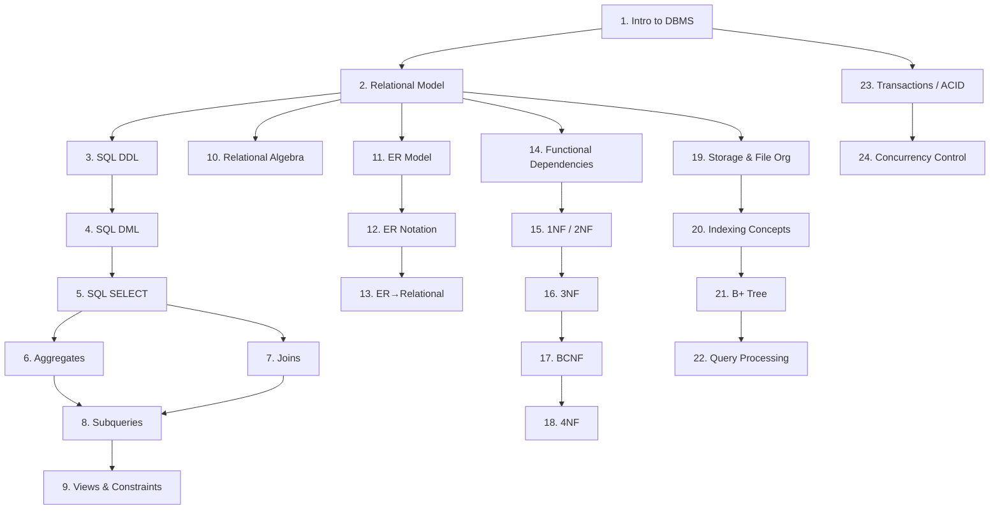

# CSE370 — Topic Map: Database Systems

Database Systems asks: how do we store, organize, query, and protect large structured datasets reliably? This course answers that through three lenses — the language of databases (SQL and relational algebra), the design of schemas (ER modeling and normalization), and the machinery underneath (storage, indexing, query processing, transactions). The lab runs MySQL via XAMPP throughout.

## Topic Table

| # | Topic | Category | Importance | Depends On |
|---|-------|----------|------------|------------|
| 1 | Introduction to Databases and DBMS — purpose, data models, DB architecture, advantages over file systems | Foundations | Core | — |
| 2 | Relational Model — relations, tuples, attributes, domains, primary key, foreign key, superkey, candidate key | Foundations | Core | 1 |
| 3 | SQL DDL — CREATE DATABASE, CREATE TABLE, ALTER TABLE, DROP, data types (INT, VARCHAR, CHAR, DECIMAL, DATE, etc.) | SQL | Core | 2 |
| 4 | SQL DML — INSERT, UPDATE, DELETE; WHERE clause in updates and deletes | SQL | Core | 3 |
| 5 | SQL SELECT basics — SELECT, FROM, WHERE, ORDER BY, DISTINCT, LIKE, BETWEEN, IN, arithmetic expressions, aliases (AS), string/math functions | SQL | Core | 4 |
| 6 | SQL Aggregate Functions — COUNT, SUM, AVG, MIN, MAX; GROUP BY; HAVING; difference from WHERE | SQL | Core | 5 |
| 7 | SQL Joins — INNER JOIN, LEFT/RIGHT/FULL OUTER JOIN, CROSS JOIN, NATURAL JOIN, self-join | SQL | Core | 5 |
| 8 | SQL Subqueries — nested queries, correlated subqueries, EXISTS, NOT EXISTS, ANY, ALL, IN with subquery | SQL | Core | 6, 7 |
| 9 | SQL Views and Constraints — CREATE VIEW, DROP VIEW, updatable views; PRIMARY KEY, FOREIGN KEY, UNIQUE, NOT NULL, CHECK, DEFAULT | SQL | Core | 8 |
| 10 | Relational Algebra — select (σ), project (π), union (∪), intersection (∩), difference (−), Cartesian product (×), natural join (⋈), rename (ρ) | Relational Theory | Core | 2 |
| 11 | Entity-Relationship (ER) Model — entity sets, attribute types (simple, composite, multi-valued, derived), relationship sets, cardinality ratios, participation constraints | Database Design | Core | 2 |
| 12 | ER Diagram Notation — Chen notation vs. crow's foot; weak entities and identifying relationships; ISA hierarchies (total/partial, overlapping/disjoint) | Database Design | Core | 11 |
| 13 | ER to Relational Mapping — converting entities, relationships (1:1, 1:N, M:N), weak entities, and ISA to relational schemas | Database Design | Core | 12 |
| 14 | Functional Dependencies — definition, trivial vs. non-trivial FDs, Armstrong's axioms, closure of attribute sets (F⁺), minimal cover (canonical cover) | Normalization | Core | 2 |
| 15 | First and Second Normal Form — 1NF (no multi-valued or composite attributes in cells), 2NF (no partial dependencies on composite key) | Normalization | Core | 14 |
| 16 | Third Normal Form (3NF) — no transitive dependencies; 3NF synthesis algorithm; lossless-join and dependency-preserving decomposition | Normalization | Core | 15 |
| 17 | Boyce-Codd Normal Form (BCNF) — definition, BCNF decomposition algorithm; when BCNF violates dependency preservation and why 3NF is the practical target | Normalization | Core | 16 |
| 18 | Higher Normal Forms — multi-valued dependencies, 4NF definition and decomposition; brief overview of 5NF | Normalization | Important | 17 |
| 19 | Storage and File Organization — magnetic disk layout, block transfer, heap files, sorted files, clustered vs. unclustered files | Storage & Indexing | Important | 2 |
| 20 | Indexing Concepts — ordered indexes, dense vs. sparse indexes, primary vs. secondary index, index on search key | Storage & Indexing | Important | 19 |
| 21 | B+ Tree Index — structure (leaf and internal nodes), search, insert, delete operations; why B+ trees dominate in practice | Storage & Indexing | Core | 20 |
| 22 | Query Processing and Optimization — operator cost model, equivalence rules, selection of join algorithms (nested-loop, hash join), plan enumeration | Query Processing | Important | 21 |
| 23 | Transaction Management — definition of a transaction, ACID properties (Atomicity, Consistency, Isolation, Durability), transaction states | Transactions | Core | 1 |
| 24 | Concurrency Control — lock-based protocols (shared/exclusive locks), two-phase locking (2PL), deadlock detection and prevention; brief on timestamp ordering | Transactions | Core | 23 |

## Dependency Graph

## Recommended Study Order

1. Introduction to Databases and DBMS
2. Relational Model
3. SQL DDL
4. SQL DML
5. SQL SELECT basics
6. SQL Aggregate Functions
7. SQL Joins
8. SQL Subqueries
9. SQL Views and Constraints
10. Relational Algebra
11. ER Model
12. ER Diagram Notation
13. ER to Relational Mapping
14. Functional Dependencies
15. First and Second Normal Form
16. Third Normal Form
17. Boyce-Codd Normal Form
18. Higher Normal Forms
19. Storage and File Organization
20. Indexing Concepts
21. B+ Tree Index
22. Query Processing and Optimization
23. Transaction Management
24. Concurrency Control

**Midterm boundary:** After Topic 13 (ER to Relational Mapping)
**Final boundary:** Topics 14–24
